# Imports

[← Back to MODULE](MODULE.md) | [← Back to INDEX](../../INDEX.md)

## Dependency Graph

```mermaid
graph TD
    third_party_CLIProxyAPIPlus_internal_api_handlers_management[third_party-CLIProxyAPIPlus-internal-api-handlers-management] --> antigravity[antigravity]
    third_party_CLIProxyAPIPlus_internal_api_handlers_management[third_party-CLIProxyAPIPlus-internal-api-handlers-management] --> base64[base64]
    third_party_CLIProxyAPIPlus_internal_api_handlers_management[third_party-CLIProxyAPIPlus-internal-api-handlers-management] --> bcrypt[bcrypt]
    third_party_CLIProxyAPIPlus_internal_api_handlers_management[third_party-CLIProxyAPIPlus-internal-api-handlers-management] --> bufio[bufio]
    third_party_CLIProxyAPIPlus_internal_api_handlers_management[third_party-CLIProxyAPIPlus-internal-api-handlers-management] --> buildinfo[buildinfo]
    third_party_CLIProxyAPIPlus_internal_api_handlers_management[third_party-CLIProxyAPIPlus-internal-api-handlers-management] --> bytes[bytes]
    third_party_CLIProxyAPIPlus_internal_api_handlers_management[third_party-CLIProxyAPIPlus-internal-api-handlers-management] --> claude[claude]
    third_party_CLIProxyAPIPlus_internal_api_handlers_management[third_party-CLIProxyAPIPlus-internal-api-handlers-management] --> codex[codex]
    third_party_CLIProxyAPIPlus_internal_api_handlers_management[third_party-CLIProxyAPIPlus-internal-api-handlers-management] --> context[context]
    third_party_CLIProxyAPIPlus_internal_api_handlers_management[third_party-CLIProxyAPIPlus-internal-api-handlers-management] --> copilot[copilot]
    third_party_CLIProxyAPIPlus_internal_api_handlers_management[third_party-CLIProxyAPIPlus-internal-api-handlers-management] --> errors[errors]
    third_party_CLIProxyAPIPlus_internal_api_handlers_management[third_party-CLIProxyAPIPlus-internal-api-handlers-management] --> filepath[filepath]
    third_party_CLIProxyAPIPlus_internal_api_handlers_management[third_party-CLIProxyAPIPlus-internal-api-handlers-management] --> fmt[fmt]
    third_party_CLIProxyAPIPlus_internal_api_handlers_management[third_party-CLIProxyAPIPlus-internal-api-handlers-management] --> geminicli[geminicli]
    third_party_CLIProxyAPIPlus_internal_api_handlers_management[third_party-CLIProxyAPIPlus-internal-api-handlers-management] --> gin[gin]
    third_party_CLIProxyAPIPlus_internal_api_handlers_management[third_party-CLIProxyAPIPlus-internal-api-handlers-management] --> gjson[gjson]
    third_party_CLIProxyAPIPlus_internal_api_handlers_management[third_party-CLIProxyAPIPlus-internal-api-handlers-management] --> google[google]
    third_party_CLIProxyAPIPlus_internal_api_handlers_management[third_party-CLIProxyAPIPlus-internal-api-handlers-management] --> hex[hex]
    third_party_CLIProxyAPIPlus_internal_api_handlers_management[third_party-CLIProxyAPIPlus-internal-api-handlers-management] --> http[http]
    third_party_CLIProxyAPIPlus_internal_api_handlers_management[third_party-CLIProxyAPIPlus-internal-api-handlers-management] --> httptest[httptest]
    third_party_CLIProxyAPIPlus_internal_api_handlers_management[third_party-CLIProxyAPIPlus-internal-api-handlers-management] --> interfaces[interfaces]
    third_party_CLIProxyAPIPlus_internal_api_handlers_management[third_party-CLIProxyAPIPlus-internal-api-handlers-management] --> json[json]
    third_party_CLIProxyAPIPlus_internal_api_handlers_management[third_party-CLIProxyAPIPlus-internal-api-handlers-management] --> kilo[kilo]
    third_party_CLIProxyAPIPlus_internal_api_handlers_management[third_party-CLIProxyAPIPlus-internal-api-handlers-management] --> kimi[kimi]
    third_party_CLIProxyAPIPlus_internal_api_handlers_management[third_party-CLIProxyAPIPlus-internal-api-handlers-management] --> logging[logging]
    third_party_CLIProxyAPIPlus_internal_api_handlers_management[third_party-CLIProxyAPIPlus-internal-api-handlers-management] --> math[math]
    third_party_CLIProxyAPIPlus_internal_api_handlers_management[third_party-CLIProxyAPIPlus-internal-api-handlers-management] --> misc[misc]
    third_party_CLIProxyAPIPlus_internal_api_handlers_management[third_party-CLIProxyAPIPlus-internal-api-handlers-management] --> net[net]
    third_party_CLIProxyAPIPlus_internal_api_handlers_management[third_party-CLIProxyAPIPlus-internal-api-handlers-management] --> oauth2[oauth2]
    third_party_CLIProxyAPIPlus_internal_api_handlers_management[third_party-CLIProxyAPIPlus-internal-api-handlers-management] --> os[os]
    third_party_CLIProxyAPIPlus_internal_api_handlers_management[third_party-CLIProxyAPIPlus-internal-api-handlers-management] --> proxyutil[proxyutil]
    third_party_CLIProxyAPIPlus_internal_api_handlers_management[third_party-CLIProxyAPIPlus-internal-api-handlers-management] --> qwen[qwen]
    third_party_CLIProxyAPIPlus_internal_api_handlers_management[third_party-CLIProxyAPIPlus-internal-api-handlers-management] --> rand[rand]
    third_party_CLIProxyAPIPlus_internal_api_handlers_management[third_party-CLIProxyAPIPlus-internal-api-handlers-management] --> registry[registry]
    third_party_CLIProxyAPIPlus_internal_api_handlers_management[third_party-CLIProxyAPIPlus-internal-api-handlers-management] --> runtime[runtime]
    third_party_CLIProxyAPIPlus_internal_api_handlers_management[third_party-CLIProxyAPIPlus-internal-api-handlers-management] --> sha256[sha256]
    third_party_CLIProxyAPIPlus_internal_api_handlers_management[third_party-CLIProxyAPIPlus-internal-api-handlers-management] --> sort[sort]
    third_party_CLIProxyAPIPlus_internal_api_handlers_management[third_party-CLIProxyAPIPlus-internal-api-handlers-management] --> strconv[strconv]
    third_party_CLIProxyAPIPlus_internal_api_handlers_management[third_party-CLIProxyAPIPlus-internal-api-handlers-management] --> strings[strings]
    third_party_CLIProxyAPIPlus_internal_api_handlers_management[third_party-CLIProxyAPIPlus-internal-api-handlers-management] --> subtle[subtle]
    third_party_CLIProxyAPIPlus_internal_api_handlers_management[third_party-CLIProxyAPIPlus-internal-api-handlers-management] --> sync[sync]
    third_party_CLIProxyAPIPlus_internal_api_handlers_management[third_party-CLIProxyAPIPlus-internal-api-handlers-management] --> synthesizer[synthesizer]
    third_party_CLIProxyAPIPlus_internal_api_handlers_management[third_party-CLIProxyAPIPlus-internal-api-handlers-management] --> testing[testing]
    third_party_CLIProxyAPIPlus_internal_api_handlers_management[third_party-CLIProxyAPIPlus-internal-api-handlers-management] --> time[time]
    third_party_CLIProxyAPIPlus_internal_api_handlers_management[third_party-CLIProxyAPIPlus-internal-api-handlers-management] --> url[url]
    third_party_CLIProxyAPIPlus_internal_api_handlers_management[third_party-CLIProxyAPIPlus-internal-api-handlers-management] --> util[util]
    third_party_CLIProxyAPIPlus_internal_api_handlers_management[third_party-CLIProxyAPIPlus-internal-api-handlers-management] --> v2[v2]
    third_party_CLIProxyAPIPlus_internal_api_handlers_management[third_party-CLIProxyAPIPlus-internal-api-handlers-management] --> yaml_v3[yaml.v3]
```

## Internal Dependencies

Dependencies within this module:

- `config`
- `io`
- `usage`
- `vertex`

## External Dependencies

Dependencies from other modules:

- `antigravity`
- `base64`
- `bcrypt`
- `bufio`
- `buildinfo`
- `bytes`
- `claude`
- `codex`
- `context`
- `copilot`
- `errors`
- `filepath`
- `fmt`
- `geminicli`
- `gin`
- `gjson`
- `google`
- `hex`
- `http`
- `httptest`
- `interfaces`
- `json`
- `kilo`
- `kimi`
- `logging`
- `math`
- `misc`
- `net`
- `oauth2`
- `os`
- `proxyutil`
- `qwen`
- `rand`
- `registry`
- `runtime`
- `sha256`
- `sort`
- `strconv`
- `strings`
- `subtle`
- `sync`
- `synthesizer`
- `testing`
- `time`
- `url`
- `util`
- `v2`
- `yaml.v3`

