# Imports

[← Back to MODULE](MODULE.md) | [← Back to INDEX](../../INDEX.md)

## Dependency Graph

```mermaid
graph TD
    third_party_CLIProxyAPIPlus_internal_api_modules_amp[third_party-CLIProxyAPIPlus-internal-api-modules-amp] --> bytes[bytes]
    third_party_CLIProxyAPIPlus_internal_api_modules_amp[third_party-CLIProxyAPIPlus-internal-api-modules-amp] --> claude[claude]
    third_party_CLIProxyAPIPlus_internal_api_modules_amp[third_party-CLIProxyAPIPlus-internal-api-modules-amp] --> config[config]
    third_party_CLIProxyAPIPlus_internal_api_modules_amp[third_party-CLIProxyAPIPlus-internal-api-modules-amp] --> context[context]
    third_party_CLIProxyAPIPlus_internal_api_modules_amp[third_party-CLIProxyAPIPlus-internal-api-modules-amp] --> errors[errors]
    third_party_CLIProxyAPIPlus_internal_api_modules_amp[third_party-CLIProxyAPIPlus-internal-api-modules-amp] --> filepath[filepath]
    third_party_CLIProxyAPIPlus_internal_api_modules_amp[third_party-CLIProxyAPIPlus-internal-api-modules-amp] --> fmt[fmt]
    third_party_CLIProxyAPIPlus_internal_api_modules_amp[third_party-CLIProxyAPIPlus-internal-api-modules-amp] --> gin[gin]
    third_party_CLIProxyAPIPlus_internal_api_modules_amp[third_party-CLIProxyAPIPlus-internal-api-modules-amp] --> gjson[gjson]
    third_party_CLIProxyAPIPlus_internal_api_modules_amp[third_party-CLIProxyAPIPlus-internal-api-modules-amp] --> gzip[gzip]
    third_party_CLIProxyAPIPlus_internal_api_modules_amp[third_party-CLIProxyAPIPlus-internal-api-modules-amp] --> http[http]
    third_party_CLIProxyAPIPlus_internal_api_modules_amp[third_party-CLIProxyAPIPlus-internal-api-modules-amp] --> httptest[httptest]
    third_party_CLIProxyAPIPlus_internal_api_modules_amp[third_party-CLIProxyAPIPlus-internal-api-modules-amp] --> httputil[httputil]
    third_party_CLIProxyAPIPlus_internal_api_modules_amp[third_party-CLIProxyAPIPlus-internal-api-modules-amp] --> io[io]
    third_party_CLIProxyAPIPlus_internal_api_modules_amp[third_party-CLIProxyAPIPlus-internal-api-modules-amp] --> json[json]
    third_party_CLIProxyAPIPlus_internal_api_modules_amp[third_party-CLIProxyAPIPlus-internal-api-modules-amp] --> logging[logging]
    third_party_CLIProxyAPIPlus_internal_api_modules_amp[third_party-CLIProxyAPIPlus-internal-api-modules-amp] --> misc[misc]
    third_party_CLIProxyAPIPlus_internal_api_modules_amp[third_party-CLIProxyAPIPlus-internal-api-modules-amp] --> net[net]
    third_party_CLIProxyAPIPlus_internal_api_modules_amp[third_party-CLIProxyAPIPlus-internal-api-modules-amp] --> openai[openai]
    third_party_CLIProxyAPIPlus_internal_api_modules_amp[third_party-CLIProxyAPIPlus-internal-api-modules-amp] --> os[os]
    third_party_CLIProxyAPIPlus_internal_api_modules_amp[third_party-CLIProxyAPIPlus-internal-api-modules-amp] --> regexp[regexp]
    third_party_CLIProxyAPIPlus_internal_api_modules_amp[third_party-CLIProxyAPIPlus-internal-api-modules-amp] --> registry[registry]
    third_party_CLIProxyAPIPlus_internal_api_modules_amp[third_party-CLIProxyAPIPlus-internal-api-modules-amp] --> sjson[sjson]
    third_party_CLIProxyAPIPlus_internal_api_modules_amp[third_party-CLIProxyAPIPlus-internal-api-modules-amp] --> strconv[strconv]
    third_party_CLIProxyAPIPlus_internal_api_modules_amp[third_party-CLIProxyAPIPlus-internal-api-modules-amp] --> strings[strings]
    third_party_CLIProxyAPIPlus_internal_api_modules_amp[third_party-CLIProxyAPIPlus-internal-api-modules-amp] --> sync[sync]
    third_party_CLIProxyAPIPlus_internal_api_modules_amp[third_party-CLIProxyAPIPlus-internal-api-modules-amp] --> testing[testing]
    third_party_CLIProxyAPIPlus_internal_api_modules_amp[third_party-CLIProxyAPIPlus-internal-api-modules-amp] --> thinking[thinking]
    third_party_CLIProxyAPIPlus_internal_api_modules_amp[third_party-CLIProxyAPIPlus-internal-api-modules-amp] --> time[time]
    third_party_CLIProxyAPIPlus_internal_api_modules_amp[third_party-CLIProxyAPIPlus-internal-api-modules-amp] --> url[url]
    third_party_CLIProxyAPIPlus_internal_api_modules_amp[third_party-CLIProxyAPIPlus-internal-api-modules-amp] --> util[util]
```

## Internal Dependencies

Dependencies within this module:

- `gemini`
- `handlers`
- `modules`
- `test`

## External Dependencies

Dependencies from other modules:

- `bytes`
- `claude`
- `config`
- `context`
- `errors`
- `filepath`
- `fmt`
- `gin`
- `gjson`
- `gzip`
- `http`
- `httptest`
- `httputil`
- `io`
- `json`
- `logging`
- `misc`
- `net`
- `openai`
- `os`
- `regexp`
- `registry`
- `sjson`
- `strconv`
- `strings`
- `sync`
- `testing`
- `thinking`
- `time`
- `url`
- `util`

