# Imports

[← Back to MODULE](MODULE.md) | [← Back to INDEX](../../INDEX.md)

## Dependency Graph

```mermaid
graph TD
    third_party_CLIProxyAPIPlus_internal_auth_claude[third_party-CLIProxyAPIPlus-internal-auth-claude] --> base64[base64]
    third_party_CLIProxyAPIPlus_internal_auth_claude[third_party-CLIProxyAPIPlus-internal-auth-claude] --> config[config]
    third_party_CLIProxyAPIPlus_internal_auth_claude[third_party-CLIProxyAPIPlus-internal-auth-claude] --> context[context]
    third_party_CLIProxyAPIPlus_internal_auth_claude[third_party-CLIProxyAPIPlus-internal-auth-claude] --> filepath[filepath]
    third_party_CLIProxyAPIPlus_internal_auth_claude[third_party-CLIProxyAPIPlus-internal-auth-claude] --> fmt[fmt]
    third_party_CLIProxyAPIPlus_internal_auth_claude[third_party-CLIProxyAPIPlus-internal-auth-claude] --> http[http]
    third_party_CLIProxyAPIPlus_internal_auth_claude[third_party-CLIProxyAPIPlus-internal-auth-claude] --> http2[http2]
    third_party_CLIProxyAPIPlus_internal_auth_claude[third_party-CLIProxyAPIPlus-internal-auth-claude] --> io[io]
    third_party_CLIProxyAPIPlus_internal_auth_claude[third_party-CLIProxyAPIPlus-internal-auth-claude] --> json[json]
    third_party_CLIProxyAPIPlus_internal_auth_claude[third_party-CLIProxyAPIPlus-internal-auth-claude] --> misc[misc]
    third_party_CLIProxyAPIPlus_internal_auth_claude[third_party-CLIProxyAPIPlus-internal-auth-claude] --> net[net]
    third_party_CLIProxyAPIPlus_internal_auth_claude[third_party-CLIProxyAPIPlus-internal-auth-claude] --> os[os]
    third_party_CLIProxyAPIPlus_internal_auth_claude[third_party-CLIProxyAPIPlus-internal-auth-claude] --> proxy[proxy]
    third_party_CLIProxyAPIPlus_internal_auth_claude[third_party-CLIProxyAPIPlus-internal-auth-claude] --> proxyutil[proxyutil]
    third_party_CLIProxyAPIPlus_internal_auth_claude[third_party-CLIProxyAPIPlus-internal-auth-claude] --> rand[rand]
    third_party_CLIProxyAPIPlus_internal_auth_claude[third_party-CLIProxyAPIPlus-internal-auth-claude] --> sha256[sha256]
    third_party_CLIProxyAPIPlus_internal_auth_claude[third_party-CLIProxyAPIPlus-internal-auth-claude] --> strings[strings]
    third_party_CLIProxyAPIPlus_internal_auth_claude[third_party-CLIProxyAPIPlus-internal-auth-claude] --> sync[sync]
    third_party_CLIProxyAPIPlus_internal_auth_claude[third_party-CLIProxyAPIPlus-internal-auth-claude] --> time[time]
    third_party_CLIProxyAPIPlus_internal_auth_claude[third_party-CLIProxyAPIPlus-internal-auth-claude] --> url[url]
```

## Internal Dependencies

Dependencies within this module:

- `errors`

## External Dependencies

Dependencies from other modules:

- `base64`
- `config`
- `context`
- `filepath`
- `fmt`
- `http`
- `http2`
- `io`
- `json`
- `misc`
- `net`
- `os`
- `proxy`
- `proxyutil`
- `rand`
- `sha256`
- `strings`
- `sync`
- `time`
- `url`

