# Imports

[← Back to MODULE](MODULE.md) | [← Back to INDEX](../../INDEX.md)

## Dependency Graph

```mermaid
graph TD
    third_party_CLIProxyAPIPlus_internal_auth_codex[third_party-CLIProxyAPIPlus-internal-auth-codex] --> atomic[atomic]
    third_party_CLIProxyAPIPlus_internal_auth_codex[third_party-CLIProxyAPIPlus-internal-auth-codex] --> base64[base64]
    third_party_CLIProxyAPIPlus_internal_auth_codex[third_party-CLIProxyAPIPlus-internal-auth-codex] --> config[config]
    third_party_CLIProxyAPIPlus_internal_auth_codex[third_party-CLIProxyAPIPlus-internal-auth-codex] --> context[context]
    third_party_CLIProxyAPIPlus_internal_auth_codex[third_party-CLIProxyAPIPlus-internal-auth-codex] --> filepath[filepath]
    third_party_CLIProxyAPIPlus_internal_auth_codex[third_party-CLIProxyAPIPlus-internal-auth-codex] --> fmt[fmt]
    third_party_CLIProxyAPIPlus_internal_auth_codex[third_party-CLIProxyAPIPlus-internal-auth-codex] --> http[http]
    third_party_CLIProxyAPIPlus_internal_auth_codex[third_party-CLIProxyAPIPlus-internal-auth-codex] --> io[io]
    third_party_CLIProxyAPIPlus_internal_auth_codex[third_party-CLIProxyAPIPlus-internal-auth-codex] --> json[json]
    third_party_CLIProxyAPIPlus_internal_auth_codex[third_party-CLIProxyAPIPlus-internal-auth-codex] --> misc[misc]
    third_party_CLIProxyAPIPlus_internal_auth_codex[third_party-CLIProxyAPIPlus-internal-auth-codex] --> net[net]
    third_party_CLIProxyAPIPlus_internal_auth_codex[third_party-CLIProxyAPIPlus-internal-auth-codex] --> os[os]
    third_party_CLIProxyAPIPlus_internal_auth_codex[third_party-CLIProxyAPIPlus-internal-auth-codex] --> rand[rand]
    third_party_CLIProxyAPIPlus_internal_auth_codex[third_party-CLIProxyAPIPlus-internal-auth-codex] --> sha256[sha256]
    third_party_CLIProxyAPIPlus_internal_auth_codex[third_party-CLIProxyAPIPlus-internal-auth-codex] --> strings[strings]
    third_party_CLIProxyAPIPlus_internal_auth_codex[third_party-CLIProxyAPIPlus-internal-auth-codex] --> sync[sync]
    third_party_CLIProxyAPIPlus_internal_auth_codex[third_party-CLIProxyAPIPlus-internal-auth-codex] --> testing[testing]
    third_party_CLIProxyAPIPlus_internal_auth_codex[third_party-CLIProxyAPIPlus-internal-auth-codex] --> time[time]
    third_party_CLIProxyAPIPlus_internal_auth_codex[third_party-CLIProxyAPIPlus-internal-auth-codex] --> unicode[unicode]
    third_party_CLIProxyAPIPlus_internal_auth_codex[third_party-CLIProxyAPIPlus-internal-auth-codex] --> url[url]
    third_party_CLIProxyAPIPlus_internal_auth_codex[third_party-CLIProxyAPIPlus-internal-auth-codex] --> util[util]
```

## Internal Dependencies

Dependencies within this module:

- `errors`

## External Dependencies

Dependencies from other modules:

- `atomic`
- `base64`
- `config`
- `context`
- `filepath`
- `fmt`
- `http`
- `io`
- `json`
- `misc`
- `net`
- `os`
- `rand`
- `sha256`
- `strings`
- `sync`
- `testing`
- `time`
- `unicode`
- `url`
- `util`

