# Imports

[← Back to MODULE](MODULE.md) | [← Back to INDEX](../../INDEX.md)

## Dependency Graph

```mermaid
graph TD
    third_party_CLIProxyAPIPlus_internal_auth_copilot[third_party-CLIProxyAPIPlus-internal-auth-copilot] --> config[config]
    third_party_CLIProxyAPIPlus_internal_auth_copilot[third_party-CLIProxyAPIPlus-internal-auth-copilot] --> context[context]
    third_party_CLIProxyAPIPlus_internal_auth_copilot[third_party-CLIProxyAPIPlus-internal-auth-copilot] --> filepath[filepath]
    third_party_CLIProxyAPIPlus_internal_auth_copilot[third_party-CLIProxyAPIPlus-internal-auth-copilot] --> fmt[fmt]
    third_party_CLIProxyAPIPlus_internal_auth_copilot[third_party-CLIProxyAPIPlus-internal-auth-copilot] --> http[http]
    third_party_CLIProxyAPIPlus_internal_auth_copilot[third_party-CLIProxyAPIPlus-internal-auth-copilot] --> httptest[httptest]
    third_party_CLIProxyAPIPlus_internal_auth_copilot[third_party-CLIProxyAPIPlus-internal-auth-copilot] --> io[io]
    third_party_CLIProxyAPIPlus_internal_auth_copilot[third_party-CLIProxyAPIPlus-internal-auth-copilot] --> json[json]
    third_party_CLIProxyAPIPlus_internal_auth_copilot[third_party-CLIProxyAPIPlus-internal-auth-copilot] --> misc[misc]
    third_party_CLIProxyAPIPlus_internal_auth_copilot[third_party-CLIProxyAPIPlus-internal-auth-copilot] --> os[os]
    third_party_CLIProxyAPIPlus_internal_auth_copilot[third_party-CLIProxyAPIPlus-internal-auth-copilot] --> strings[strings]
    third_party_CLIProxyAPIPlus_internal_auth_copilot[third_party-CLIProxyAPIPlus-internal-auth-copilot] --> testing[testing]
    third_party_CLIProxyAPIPlus_internal_auth_copilot[third_party-CLIProxyAPIPlus-internal-auth-copilot] --> time[time]
    third_party_CLIProxyAPIPlus_internal_auth_copilot[third_party-CLIProxyAPIPlus-internal-auth-copilot] --> url[url]
    third_party_CLIProxyAPIPlus_internal_auth_copilot[third_party-CLIProxyAPIPlus-internal-auth-copilot] --> util[util]
```

## Internal Dependencies

Dependencies within this module:

- `errors`

## External Dependencies

Dependencies from other modules:

- `config`
- `context`
- `filepath`
- `fmt`
- `http`
- `httptest`
- `io`
- `json`
- `misc`
- `os`
- `strings`
- `testing`
- `time`
- `url`
- `util`

