# Imports

[← Back to MODULE](MODULE.md) | [← Back to INDEX](../../INDEX.md)

## Dependency Graph

```mermaid
graph TD
    third_party_CLIProxyAPIPlus_internal_auth_kiro[third_party-CLIProxyAPIPlus-internal-auth-kiro] --> base64[base64]
    third_party_CLIProxyAPIPlus_internal_auth_kiro[third_party-CLIProxyAPIPlus-internal-auth-kiro] --> binary[binary]
    third_party_CLIProxyAPIPlus_internal_auth_kiro[third_party-CLIProxyAPIPlus-internal-auth-kiro] --> browser[browser]
    third_party_CLIProxyAPIPlus_internal_auth_kiro[third_party-CLIProxyAPIPlus-internal-auth-kiro] --> bufio[bufio]
    third_party_CLIProxyAPIPlus_internal_auth_kiro[third_party-CLIProxyAPIPlus-internal-auth-kiro] --> config[config]
    third_party_CLIProxyAPIPlus_internal_auth_kiro[third_party-CLIProxyAPIPlus-internal-auth-kiro] --> context[context]
    third_party_CLIProxyAPIPlus_internal_auth_kiro[third_party-CLIProxyAPIPlus-internal-auth-kiro] --> errors[errors]
    third_party_CLIProxyAPIPlus_internal_auth_kiro[third_party-CLIProxyAPIPlus-internal-auth-kiro] --> exec[exec]
    third_party_CLIProxyAPIPlus_internal_auth_kiro[third_party-CLIProxyAPIPlus-internal-auth-kiro] --> filepath[filepath]
    third_party_CLIProxyAPIPlus_internal_auth_kiro[third_party-CLIProxyAPIPlus-internal-auth-kiro] --> fmt[fmt]
    third_party_CLIProxyAPIPlus_internal_auth_kiro[third_party-CLIProxyAPIPlus-internal-auth-kiro] --> fs[fs]
    third_party_CLIProxyAPIPlus_internal_auth_kiro[third_party-CLIProxyAPIPlus-internal-auth-kiro] --> gin[gin]
    third_party_CLIProxyAPIPlus_internal_auth_kiro[third_party-CLIProxyAPIPlus-internal-auth-kiro] --> hex[hex]
    third_party_CLIProxyAPIPlus_internal_auth_kiro[third_party-CLIProxyAPIPlus-internal-auth-kiro] --> html[html]
    third_party_CLIProxyAPIPlus_internal_auth_kiro[third_party-CLIProxyAPIPlus-internal-auth-kiro] --> http[http]
    third_party_CLIProxyAPIPlus_internal_auth_kiro[third_party-CLIProxyAPIPlus-internal-auth-kiro] --> httptest[httptest]
    third_party_CLIProxyAPIPlus_internal_auth_kiro[third_party-CLIProxyAPIPlus-internal-auth-kiro] --> io[io]
    third_party_CLIProxyAPIPlus_internal_auth_kiro[third_party-CLIProxyAPIPlus-internal-auth-kiro] --> json[json]
    third_party_CLIProxyAPIPlus_internal_auth_kiro[third_party-CLIProxyAPIPlus-internal-auth-kiro] --> log[log]
    third_party_CLIProxyAPIPlus_internal_auth_kiro[third_party-CLIProxyAPIPlus-internal-auth-kiro] --> math[math]
    third_party_CLIProxyAPIPlus_internal_auth_kiro[third_party-CLIProxyAPIPlus-internal-auth-kiro] --> net[net]
    third_party_CLIProxyAPIPlus_internal_auth_kiro[third_party-CLIProxyAPIPlus-internal-auth-kiro] --> rand[rand]
    third_party_CLIProxyAPIPlus_internal_auth_kiro[third_party-CLIProxyAPIPlus-internal-auth-kiro] --> runtime[runtime]
    third_party_CLIProxyAPIPlus_internal_auth_kiro[third_party-CLIProxyAPIPlus-internal-auth-kiro] --> semaphore[semaphore]
    third_party_CLIProxyAPIPlus_internal_auth_kiro[third_party-CLIProxyAPIPlus-internal-auth-kiro] --> sha256[sha256]
    third_party_CLIProxyAPIPlus_internal_auth_kiro[third_party-CLIProxyAPIPlus-internal-auth-kiro] --> slices[slices]
    third_party_CLIProxyAPIPlus_internal_auth_kiro[third_party-CLIProxyAPIPlus-internal-auth-kiro] --> sort[sort]
    third_party_CLIProxyAPIPlus_internal_auth_kiro[third_party-CLIProxyAPIPlus-internal-auth-kiro] --> strings[strings]
    third_party_CLIProxyAPIPlus_internal_auth_kiro[third_party-CLIProxyAPIPlus-internal-auth-kiro] --> sync[sync]
    third_party_CLIProxyAPIPlus_internal_auth_kiro[third_party-CLIProxyAPIPlus-internal-auth-kiro] --> term[term]
    third_party_CLIProxyAPIPlus_internal_auth_kiro[third_party-CLIProxyAPIPlus-internal-auth-kiro] --> testing[testing]
    third_party_CLIProxyAPIPlus_internal_auth_kiro[third_party-CLIProxyAPIPlus-internal-auth-kiro] --> time[time]
    third_party_CLIProxyAPIPlus_internal_auth_kiro[third_party-CLIProxyAPIPlus-internal-auth-kiro] --> url[url]
    third_party_CLIProxyAPIPlus_internal_auth_kiro[third_party-CLIProxyAPIPlus-internal-auth-kiro] --> uuid[uuid]
```

## Internal Dependencies

Dependencies within this module:

- `os`
- `template`
- `util`

## External Dependencies

Dependencies from other modules:

- `base64`
- `binary`
- `browser`
- `bufio`
- `config`
- `context`
- `errors`
- `exec`
- `filepath`
- `fmt`
- `fs`
- `gin`
- `hex`
- `html`
- `http`
- `httptest`
- `io`
- `json`
- `log`
- `math`
- `net`
- `rand`
- `runtime`
- `semaphore`
- `sha256`
- `slices`
- `sort`
- `strings`
- `sync`
- `term`
- `testing`
- `time`
- `url`
- `uuid`

