# Imports

[← Back to MODULE](MODULE.md) | [← Back to INDEX](../../INDEX.md)

## Dependency Graph

```mermaid
graph TD
    third_party_CLIProxyAPIPlus_internal_cmd[third_party-CLIProxyAPIPlus-internal-cmd] --> api[api]
    third_party_CLIProxyAPIPlus_internal_cmd[third_party-CLIProxyAPIPlus-internal-cmd] --> bufio[bufio]
    third_party_CLIProxyAPIPlus_internal_cmd[third_party-CLIProxyAPIPlus-internal-cmd] --> bytes[bytes]
    third_party_CLIProxyAPIPlus_internal_cmd[third_party-CLIProxyAPIPlus-internal-cmd] --> claude[claude]
    third_party_CLIProxyAPIPlus_internal_cmd[third_party-CLIProxyAPIPlus-internal-cmd] --> cliproxy[cliproxy]
    third_party_CLIProxyAPIPlus_internal_cmd[third_party-CLIProxyAPIPlus-internal-cmd] --> codex[codex]
    third_party_CLIProxyAPIPlus_internal_cmd[third_party-CLIProxyAPIPlus-internal-cmd] --> config[config]
    third_party_CLIProxyAPIPlus_internal_cmd[third_party-CLIProxyAPIPlus-internal-cmd] --> context[context]
    third_party_CLIProxyAPIPlus_internal_cmd[third_party-CLIProxyAPIPlus-internal-cmd] --> errors[errors]
    third_party_CLIProxyAPIPlus_internal_cmd[third_party-CLIProxyAPIPlus-internal-cmd] --> filepath[filepath]
    third_party_CLIProxyAPIPlus_internal_cmd[third_party-CLIProxyAPIPlus-internal-cmd] --> fmt[fmt]
    third_party_CLIProxyAPIPlus_internal_cmd[third_party-CLIProxyAPIPlus-internal-cmd] --> gemini[gemini]
    third_party_CLIProxyAPIPlus_internal_cmd[third_party-CLIProxyAPIPlus-internal-cmd] --> gjson[gjson]
    third_party_CLIProxyAPIPlus_internal_cmd[third_party-CLIProxyAPIPlus-internal-cmd] --> http[http]
    third_party_CLIProxyAPIPlus_internal_cmd[third_party-CLIProxyAPIPlus-internal-cmd] --> interfaces[interfaces]
    third_party_CLIProxyAPIPlus_internal_cmd[third_party-CLIProxyAPIPlus-internal-cmd] --> io[io]
    third_party_CLIProxyAPIPlus_internal_cmd[third_party-CLIProxyAPIPlus-internal-cmd] --> json[json]
    third_party_CLIProxyAPIPlus_internal_cmd[third_party-CLIProxyAPIPlus-internal-cmd] --> misc[misc]
    third_party_CLIProxyAPIPlus_internal_cmd[third_party-CLIProxyAPIPlus-internal-cmd] --> os[os]
    third_party_CLIProxyAPIPlus_internal_cmd[third_party-CLIProxyAPIPlus-internal-cmd] --> signal[signal]
    third_party_CLIProxyAPIPlus_internal_cmd[third_party-CLIProxyAPIPlus-internal-cmd] --> strconv[strconv]
    third_party_CLIProxyAPIPlus_internal_cmd[third_party-CLIProxyAPIPlus-internal-cmd] --> strings[strings]
    third_party_CLIProxyAPIPlus_internal_cmd[third_party-CLIProxyAPIPlus-internal-cmd] --> syscall[syscall]
    third_party_CLIProxyAPIPlus_internal_cmd[third_party-CLIProxyAPIPlus-internal-cmd] --> time[time]
    third_party_CLIProxyAPIPlus_internal_cmd[third_party-CLIProxyAPIPlus-internal-cmd] --> util[util]
```

## Internal Dependencies

Dependencies within this module:

- `iflow`
- `vertex`

## External Dependencies

Dependencies from other modules:

- `api`
- `bufio`
- `bytes`
- `claude`
- `cliproxy`
- `codex`
- `config`
- `context`
- `errors`
- `filepath`
- `fmt`
- `gemini`
- `gjson`
- `http`
- `interfaces`
- `io`
- `json`
- `misc`
- `os`
- `signal`
- `strconv`
- `strings`
- `syscall`
- `time`
- `util`

