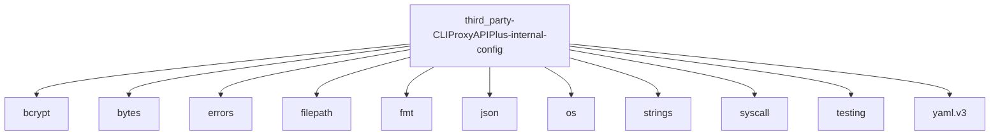

# Imports

[← Back to MODULE](MODULE.md) | [← Back to INDEX](../../INDEX.md)

## Dependency Graph

## External Dependencies

Dependencies from other modules:

- `bcrypt`
- `bytes`
- `errors`
- `filepath`
- `fmt`
- `json`
- `os`
- `strings`
- `syscall`
- `testing`
- `yaml.v3`

