# Imports

[← Back to MODULE](MODULE.md) | [← Back to INDEX](../../INDEX.md)

## Dependency Graph

```mermaid
graph TD
    third_party_CLIProxyAPIPlus_internal_logging[third_party-CLIProxyAPIPlus-internal-logging] --> atomic[atomic]
    third_party_CLIProxyAPIPlus_internal_logging[third_party-CLIProxyAPIPlus-internal-logging] --> brotli[brotli]
    third_party_CLIProxyAPIPlus_internal_logging[third_party-CLIProxyAPIPlus-internal-logging] --> buildinfo[buildinfo]
    third_party_CLIProxyAPIPlus_internal_logging[third_party-CLIProxyAPIPlus-internal-logging] --> bytes[bytes]
    third_party_CLIProxyAPIPlus_internal_logging[third_party-CLIProxyAPIPlus-internal-logging] --> config[config]
    third_party_CLIProxyAPIPlus_internal_logging[third_party-CLIProxyAPIPlus-internal-logging] --> context[context]
    third_party_CLIProxyAPIPlus_internal_logging[third_party-CLIProxyAPIPlus-internal-logging] --> debug[debug]
    third_party_CLIProxyAPIPlus_internal_logging[third_party-CLIProxyAPIPlus-internal-logging] --> errors[errors]
    third_party_CLIProxyAPIPlus_internal_logging[third_party-CLIProxyAPIPlus-internal-logging] --> filepath[filepath]
    third_party_CLIProxyAPIPlus_internal_logging[third_party-CLIProxyAPIPlus-internal-logging] --> flate[flate]
    third_party_CLIProxyAPIPlus_internal_logging[third_party-CLIProxyAPIPlus-internal-logging] --> fmt[fmt]
    third_party_CLIProxyAPIPlus_internal_logging[third_party-CLIProxyAPIPlus-internal-logging] --> gzip[gzip]
    third_party_CLIProxyAPIPlus_internal_logging[third_party-CLIProxyAPIPlus-internal-logging] --> hex[hex]
    third_party_CLIProxyAPIPlus_internal_logging[third_party-CLIProxyAPIPlus-internal-logging] --> http[http]
    third_party_CLIProxyAPIPlus_internal_logging[third_party-CLIProxyAPIPlus-internal-logging] --> httptest[httptest]
    third_party_CLIProxyAPIPlus_internal_logging[third_party-CLIProxyAPIPlus-internal-logging] --> interfaces[interfaces]
    third_party_CLIProxyAPIPlus_internal_logging[third_party-CLIProxyAPIPlus-internal-logging] --> io[io]
    third_party_CLIProxyAPIPlus_internal_logging[third_party-CLIProxyAPIPlus-internal-logging] --> lumberjack_v2[lumberjack.v2]
    third_party_CLIProxyAPIPlus_internal_logging[third_party-CLIProxyAPIPlus-internal-logging] --> os[os]
    third_party_CLIProxyAPIPlus_internal_logging[third_party-CLIProxyAPIPlus-internal-logging] --> rand[rand]
    third_party_CLIProxyAPIPlus_internal_logging[third_party-CLIProxyAPIPlus-internal-logging] --> regexp[regexp]
    third_party_CLIProxyAPIPlus_internal_logging[third_party-CLIProxyAPIPlus-internal-logging] --> sort[sort]
    third_party_CLIProxyAPIPlus_internal_logging[third_party-CLIProxyAPIPlus-internal-logging] --> strings[strings]
    third_party_CLIProxyAPIPlus_internal_logging[third_party-CLIProxyAPIPlus-internal-logging] --> sync[sync]
    third_party_CLIProxyAPIPlus_internal_logging[third_party-CLIProxyAPIPlus-internal-logging] --> testing[testing]
    third_party_CLIProxyAPIPlus_internal_logging[third_party-CLIProxyAPIPlus-internal-logging] --> time[time]
    third_party_CLIProxyAPIPlus_internal_logging[third_party-CLIProxyAPIPlus-internal-logging] --> util[util]
    third_party_CLIProxyAPIPlus_internal_logging[third_party-CLIProxyAPIPlus-internal-logging] --> zstd[zstd]
```

## Internal Dependencies

Dependencies within this module:

- `gin`

## External Dependencies

Dependencies from other modules:

- `atomic`
- `brotli`
- `buildinfo`
- `bytes`
- `config`
- `context`
- `debug`
- `errors`
- `filepath`
- `flate`
- `fmt`
- `gzip`
- `hex`
- `http`
- `httptest`
- `interfaces`
- `io`
- `lumberjack.v2`
- `os`
- `rand`
- `regexp`
- `sort`
- `strings`
- `sync`
- `testing`
- `time`
- `util`
- `zstd`

