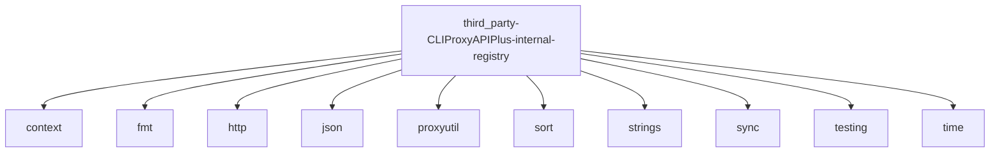

# Imports

[← Back to MODULE](MODULE.md) | [← Back to INDEX](../../INDEX.md)

## Dependency Graph

## Internal Dependencies

Dependencies within this module:

- `io`

## External Dependencies

Dependencies from other modules:

- `context`
- `fmt`
- `http`
- `json`
- `proxyutil`
- `sort`
- `strings`
- `sync`
- `testing`
- `time`

