# Imports

[← Back to MODULE](MODULE.md) | [← Back to INDEX](../../INDEX.md)

## Dependency Graph

```mermaid
graph TD
    third_party_CLIProxyAPIPlus_internal_runtime_executor_helps[third_party-CLIProxyAPIPlus-internal-runtime-executor-helps] --> big[big]
    third_party_CLIProxyAPIPlus_internal_runtime_executor_helps[third_party-CLIProxyAPIPlus-internal-runtime-executor-helps] --> bufio[bufio]
    third_party_CLIProxyAPIPlus_internal_runtime_executor_helps[third_party-CLIProxyAPIPlus-internal-runtime-executor-helps] --> buildinfo[buildinfo]
    third_party_CLIProxyAPIPlus_internal_runtime_executor_helps[third_party-CLIProxyAPIPlus-internal-runtime-executor-helps] --> bytes[bytes]
    third_party_CLIProxyAPIPlus_internal_runtime_executor_helps[third_party-CLIProxyAPIPlus-internal-runtime-executor-helps] --> config[config]
    third_party_CLIProxyAPIPlus_internal_runtime_executor_helps[third_party-CLIProxyAPIPlus-internal-runtime-executor-helps] --> context[context]
    third_party_CLIProxyAPIPlus_internal_runtime_executor_helps[third_party-CLIProxyAPIPlus-internal-runtime-executor-helps] --> errors[errors]
    third_party_CLIProxyAPIPlus_internal_runtime_executor_helps[third_party-CLIProxyAPIPlus-internal-runtime-executor-helps] --> fmt[fmt]
    third_party_CLIProxyAPIPlus_internal_runtime_executor_helps[third_party-CLIProxyAPIPlus-internal-runtime-executor-helps] --> gjson[gjson]
    third_party_CLIProxyAPIPlus_internal_runtime_executor_helps[third_party-CLIProxyAPIPlus-internal-runtime-executor-helps] --> hex[hex]
    third_party_CLIProxyAPIPlus_internal_runtime_executor_helps[third_party-CLIProxyAPIPlus-internal-runtime-executor-helps] --> html[html]
    third_party_CLIProxyAPIPlus_internal_runtime_executor_helps[third_party-CLIProxyAPIPlus-internal-runtime-executor-helps] --> http[http]
    third_party_CLIProxyAPIPlus_internal_runtime_executor_helps[third_party-CLIProxyAPIPlus-internal-runtime-executor-helps] --> http2[http2]
    third_party_CLIProxyAPIPlus_internal_runtime_executor_helps[third_party-CLIProxyAPIPlus-internal-runtime-executor-helps] --> json[json]
    third_party_CLIProxyAPIPlus_internal_runtime_executor_helps[third_party-CLIProxyAPIPlus-internal-runtime-executor-helps] --> md5[md5]
    third_party_CLIProxyAPIPlus_internal_runtime_executor_helps[third_party-CLIProxyAPIPlus-internal-runtime-executor-helps] --> net[net]
    third_party_CLIProxyAPIPlus_internal_runtime_executor_helps[third_party-CLIProxyAPIPlus-internal-runtime-executor-helps] --> pem[pem]
    third_party_CLIProxyAPIPlus_internal_runtime_executor_helps[third_party-CLIProxyAPIPlus-internal-runtime-executor-helps] --> proxyutil[proxyutil]
    third_party_CLIProxyAPIPlus_internal_runtime_executor_helps[third_party-CLIProxyAPIPlus-internal-runtime-executor-helps] --> rand[rand]
    third_party_CLIProxyAPIPlus_internal_runtime_executor_helps[third_party-CLIProxyAPIPlus-internal-runtime-executor-helps] --> regexp[regexp]
    third_party_CLIProxyAPIPlus_internal_runtime_executor_helps[third_party-CLIProxyAPIPlus-internal-runtime-executor-helps] --> rsa[rsa]
    third_party_CLIProxyAPIPlus_internal_runtime_executor_helps[third_party-CLIProxyAPIPlus-internal-runtime-executor-helps] --> sha256[sha256]
    third_party_CLIProxyAPIPlus_internal_runtime_executor_helps[third_party-CLIProxyAPIPlus-internal-runtime-executor-helps] --> sjson[sjson]
    third_party_CLIProxyAPIPlus_internal_runtime_executor_helps[third_party-CLIProxyAPIPlus-internal-runtime-executor-helps] --> sort[sort]
    third_party_CLIProxyAPIPlus_internal_runtime_executor_helps[third_party-CLIProxyAPIPlus-internal-runtime-executor-helps] --> strconv[strconv]
    third_party_CLIProxyAPIPlus_internal_runtime_executor_helps[third_party-CLIProxyAPIPlus-internal-runtime-executor-helps] --> strings[strings]
    third_party_CLIProxyAPIPlus_internal_runtime_executor_helps[third_party-CLIProxyAPIPlus-internal-runtime-executor-helps] --> sync[sync]
    third_party_CLIProxyAPIPlus_internal_runtime_executor_helps[third_party-CLIProxyAPIPlus-internal-runtime-executor-helps] --> testing[testing]
    third_party_CLIProxyAPIPlus_internal_runtime_executor_helps[third_party-CLIProxyAPIPlus-internal-runtime-executor-helps] --> tokenizer[tokenizer]
    third_party_CLIProxyAPIPlus_internal_runtime_executor_helps[third_party-CLIProxyAPIPlus-internal-runtime-executor-helps] --> url[url]
    third_party_CLIProxyAPIPlus_internal_runtime_executor_helps[third_party-CLIProxyAPIPlus-internal-runtime-executor-helps] --> utf8[utf8]
    third_party_CLIProxyAPIPlus_internal_runtime_executor_helps[third_party-CLIProxyAPIPlus-internal-runtime-executor-helps] --> uuid[uuid]
    third_party_CLIProxyAPIPlus_internal_runtime_executor_helps[third_party-CLIProxyAPIPlus-internal-runtime-executor-helps] --> x509[x509]
```

## Internal Dependencies

Dependencies within this module:

- `gin`
- `io`
- `logging`
- `proxy`
- `runtime`
- `thinking`
- `time`
- `tls`
- `usage`
- `util`

## External Dependencies

Dependencies from other modules:

- `big`
- `bufio`
- `buildinfo`
- `bytes`
- `config`
- `context`
- `errors`
- `fmt`
- `gjson`
- `hex`
- `html`
- `http`
- `http2`
- `json`
- `md5`
- `net`
- `pem`
- `proxyutil`
- `rand`
- `regexp`
- `rsa`
- `sha256`
- `sjson`
- `sort`
- `strconv`
- `strings`
- `sync`
- `testing`
- `tokenizer`
- `url`
- `utf8`
- `uuid`
- `x509`

