# Imports

[← Back to MODULE](MODULE.md) | [← Back to INDEX](../../INDEX.md)

## Dependency Graph

```mermaid
graph TD
    third_party_CLIProxyAPIPlus_internal_runtime_executor[third_party-CLIProxyAPIPlus-internal-runtime-executor] --> atomic[atomic]
    third_party_CLIProxyAPIPlus_internal_runtime_executor[third_party-CLIProxyAPIPlus-internal-runtime-executor] --> base64[base64]
    third_party_CLIProxyAPIPlus_internal_runtime_executor[third_party-CLIProxyAPIPlus-internal-runtime-executor] --> binary[binary]
    third_party_CLIProxyAPIPlus_internal_runtime_executor[third_party-CLIProxyAPIPlus-internal-runtime-executor] --> brotli[brotli]
    third_party_CLIProxyAPIPlus_internal_runtime_executor[third_party-CLIProxyAPIPlus-internal-runtime-executor] --> bufio[bufio]
    third_party_CLIProxyAPIPlus_internal_runtime_executor[third_party-CLIProxyAPIPlus-internal-runtime-executor] --> bytes[bytes]
    third_party_CLIProxyAPIPlus_internal_runtime_executor[third_party-CLIProxyAPIPlus-internal-runtime-executor] --> config[config]
    third_party_CLIProxyAPIPlus_internal_runtime_executor[third_party-CLIProxyAPIPlus-internal-runtime-executor] --> context[context]
    third_party_CLIProxyAPIPlus_internal_runtime_executor[third_party-CLIProxyAPIPlus-internal-runtime-executor] --> errors[errors]
    third_party_CLIProxyAPIPlus_internal_runtime_executor[third_party-CLIProxyAPIPlus-internal-runtime-executor] --> filepath[filepath]
    third_party_CLIProxyAPIPlus_internal_runtime_executor[third_party-CLIProxyAPIPlus-internal-runtime-executor] --> flate[flate]
    third_party_CLIProxyAPIPlus_internal_runtime_executor[third_party-CLIProxyAPIPlus-internal-runtime-executor] --> fmt[fmt]
    third_party_CLIProxyAPIPlus_internal_runtime_executor[third_party-CLIProxyAPIPlus-internal-runtime-executor] --> geminicli[geminicli]
    third_party_CLIProxyAPIPlus_internal_runtime_executor[third_party-CLIProxyAPIPlus-internal-runtime-executor] --> gjson[gjson]
    third_party_CLIProxyAPIPlus_internal_runtime_executor[third_party-CLIProxyAPIPlus-internal-runtime-executor] --> google[google]
    third_party_CLIProxyAPIPlus_internal_runtime_executor[third_party-CLIProxyAPIPlus-internal-runtime-executor] --> gzip[gzip]
    third_party_CLIProxyAPIPlus_internal_runtime_executor[third_party-CLIProxyAPIPlus-internal-runtime-executor] --> hex[hex]
    third_party_CLIProxyAPIPlus_internal_runtime_executor[third_party-CLIProxyAPIPlus-internal-runtime-executor] --> hmac[hmac]
    third_party_CLIProxyAPIPlus_internal_runtime_executor[third_party-CLIProxyAPIPlus-internal-runtime-executor] --> html[html]
    third_party_CLIProxyAPIPlus_internal_runtime_executor[third_party-CLIProxyAPIPlus-internal-runtime-executor] --> http[http]
    third_party_CLIProxyAPIPlus_internal_runtime_executor[third_party-CLIProxyAPIPlus-internal-runtime-executor] --> httptest[httptest]
    third_party_CLIProxyAPIPlus_internal_runtime_executor[third_party-CLIProxyAPIPlus-internal-runtime-executor] --> json[json]
    third_party_CLIProxyAPIPlus_internal_runtime_executor[third_party-CLIProxyAPIPlus-internal-runtime-executor] --> misc[misc]
    third_party_CLIProxyAPIPlus_internal_runtime_executor[third_party-CLIProxyAPIPlus-internal-runtime-executor] --> net[net]
    third_party_CLIProxyAPIPlus_internal_runtime_executor[third_party-CLIProxyAPIPlus-internal-runtime-executor] --> oauth2[oauth2]
    third_party_CLIProxyAPIPlus_internal_runtime_executor[third_party-CLIProxyAPIPlus-internal-runtime-executor] --> os[os]
    third_party_CLIProxyAPIPlus_internal_runtime_executor[third_party-CLIProxyAPIPlus-internal-runtime-executor] --> proxyutil[proxyutil]
    third_party_CLIProxyAPIPlus_internal_runtime_executor[third_party-CLIProxyAPIPlus-internal-runtime-executor] --> rand[rand]
    third_party_CLIProxyAPIPlus_internal_runtime_executor[third_party-CLIProxyAPIPlus-internal-runtime-executor] --> regexp[regexp]
    third_party_CLIProxyAPIPlus_internal_runtime_executor[third_party-CLIProxyAPIPlus-internal-runtime-executor] --> registry[registry]
    third_party_CLIProxyAPIPlus_internal_runtime_executor[third_party-CLIProxyAPIPlus-internal-runtime-executor] --> sha256[sha256]
    third_party_CLIProxyAPIPlus_internal_runtime_executor[third_party-CLIProxyAPIPlus-internal-runtime-executor] --> sjson[sjson]
    third_party_CLIProxyAPIPlus_internal_runtime_executor[third_party-CLIProxyAPIPlus-internal-runtime-executor] --> sort[sort]
    third_party_CLIProxyAPIPlus_internal_runtime_executor[third_party-CLIProxyAPIPlus-internal-runtime-executor] --> strconv[strconv]
    third_party_CLIProxyAPIPlus_internal_runtime_executor[third_party-CLIProxyAPIPlus-internal-runtime-executor] --> strings[strings]
    third_party_CLIProxyAPIPlus_internal_runtime_executor[third_party-CLIProxyAPIPlus-internal-runtime-executor] --> sync[sync]
    third_party_CLIProxyAPIPlus_internal_runtime_executor[third_party-CLIProxyAPIPlus-internal-runtime-executor] --> syscall[syscall]
    third_party_CLIProxyAPIPlus_internal_runtime_executor[third_party-CLIProxyAPIPlus-internal-runtime-executor] --> testing[testing]
    third_party_CLIProxyAPIPlus_internal_runtime_executor[third_party-CLIProxyAPIPlus-internal-runtime-executor] --> textproto[textproto]
    third_party_CLIProxyAPIPlus_internal_runtime_executor[third_party-CLIProxyAPIPlus-internal-runtime-executor] --> tls[tls]
    third_party_CLIProxyAPIPlus_internal_runtime_executor[third_party-CLIProxyAPIPlus-internal-runtime-executor] --> tokenizer[tokenizer]
    third_party_CLIProxyAPIPlus_internal_runtime_executor[third_party-CLIProxyAPIPlus-internal-runtime-executor] --> url[url]
    third_party_CLIProxyAPIPlus_internal_runtime_executor[third_party-CLIProxyAPIPlus-internal-runtime-executor] --> utf8[utf8]
    third_party_CLIProxyAPIPlus_internal_runtime_executor[third_party-CLIProxyAPIPlus-internal-runtime-executor] --> uuid[uuid]
    third_party_CLIProxyAPIPlus_internal_runtime_executor[third_party-CLIProxyAPIPlus-internal-runtime-executor] --> wsrelay[wsrelay]
    third_party_CLIProxyAPIPlus_internal_runtime_executor[third_party-CLIProxyAPIPlus-internal-runtime-executor] --> zstd[zstd]
```

## Internal Dependencies

Dependencies within this module:

- `gin`
- `gitlab`
- `io`
- `logging`
- `proxy`
- `runtime`
- `thinking`
- `time`
- `usage`
- `util`
- `websocket`

## External Dependencies

Dependencies from other modules:

- `atomic`
- `base64`
- `binary`
- `brotli`
- `bufio`
- `bytes`
- `config`
- `context`
- `errors`
- `filepath`
- `flate`
- `fmt`
- `geminicli`
- `gjson`
- `google`
- `gzip`
- `hex`
- `hmac`
- `html`
- `http`
- `httptest`
- `json`
- `misc`
- `net`
- `oauth2`
- `os`
- `proxyutil`
- `rand`
- `regexp`
- `registry`
- `sha256`
- `sjson`
- `sort`
- `strconv`
- `strings`
- `sync`
- `syscall`
- `testing`
- `textproto`
- `tls`
- `tokenizer`
- `url`
- `utf8`
- `uuid`
- `wsrelay`
- `zstd`

