# Imports

[← Back to MODULE](MODULE.md) | [← Back to INDEX](../../INDEX.md)

## Dependency Graph

```mermaid
graph TD
    third_party_CLIProxyAPIPlus_internal_translator_claude_openai_chat_completions[third_party-CLIProxyAPIPlus-internal-translator-claude-openai-chat-completions] --> big[big]
    third_party_CLIProxyAPIPlus_internal_translator_claude_openai_chat_completions[third_party-CLIProxyAPIPlus-internal-translator-claude-openai-chat-completions] --> bytes[bytes]
    third_party_CLIProxyAPIPlus_internal_translator_claude_openai_chat_completions[third_party-CLIProxyAPIPlus-internal-translator-claude-openai-chat-completions] --> context[context]
    third_party_CLIProxyAPIPlus_internal_translator_claude_openai_chat_completions[third_party-CLIProxyAPIPlus-internal-translator-claude-openai-chat-completions] --> fmt[fmt]
    third_party_CLIProxyAPIPlus_internal_translator_claude_openai_chat_completions[third_party-CLIProxyAPIPlus-internal-translator-claude-openai-chat-completions] --> gjson[gjson]
    third_party_CLIProxyAPIPlus_internal_translator_claude_openai_chat_completions[third_party-CLIProxyAPIPlus-internal-translator-claude-openai-chat-completions] --> hex[hex]
    third_party_CLIProxyAPIPlus_internal_translator_claude_openai_chat_completions[third_party-CLIProxyAPIPlus-internal-translator-claude-openai-chat-completions] --> interfaces[interfaces]
    third_party_CLIProxyAPIPlus_internal_translator_claude_openai_chat_completions[third_party-CLIProxyAPIPlus-internal-translator-claude-openai-chat-completions] --> rand[rand]
    third_party_CLIProxyAPIPlus_internal_translator_claude_openai_chat_completions[third_party-CLIProxyAPIPlus-internal-translator-claude-openai-chat-completions] --> registry[registry]
    third_party_CLIProxyAPIPlus_internal_translator_claude_openai_chat_completions[third_party-CLIProxyAPIPlus-internal-translator-claude-openai-chat-completions] --> sha256[sha256]
    third_party_CLIProxyAPIPlus_internal_translator_claude_openai_chat_completions[third_party-CLIProxyAPIPlus-internal-translator-claude-openai-chat-completions] --> sjson[sjson]
    third_party_CLIProxyAPIPlus_internal_translator_claude_openai_chat_completions[third_party-CLIProxyAPIPlus-internal-translator-claude-openai-chat-completions] --> strings[strings]
    third_party_CLIProxyAPIPlus_internal_translator_claude_openai_chat_completions[third_party-CLIProxyAPIPlus-internal-translator-claude-openai-chat-completions] --> testing[testing]
    third_party_CLIProxyAPIPlus_internal_translator_claude_openai_chat_completions[third_party-CLIProxyAPIPlus-internal-translator-claude-openai-chat-completions] --> thinking[thinking]
    third_party_CLIProxyAPIPlus_internal_translator_claude_openai_chat_completions[third_party-CLIProxyAPIPlus-internal-translator-claude-openai-chat-completions] --> time[time]
    third_party_CLIProxyAPIPlus_internal_translator_claude_openai_chat_completions[third_party-CLIProxyAPIPlus-internal-translator-claude-openai-chat-completions] --> uuid[uuid]
```

## Internal Dependencies

Dependencies within this module:

- `translator`

## External Dependencies

Dependencies from other modules:

- `big`
- `bytes`
- `context`
- `fmt`
- `gjson`
- `hex`
- `interfaces`
- `rand`
- `registry`
- `sha256`
- `sjson`
- `strings`
- `testing`
- `thinking`
- `time`
- `uuid`

