# Imports

[← Back to MODULE](MODULE.md) | [← Back to INDEX](../../INDEX.md)

## Dependency Graph

```mermaid
graph TD
    third_party_CLIProxyAPIPlus_internal_translator_kiro_claude[third_party-CLIProxyAPIPlus-internal-translator-kiro-claude] --> atomic[atomic]
    third_party_CLIProxyAPIPlus_internal_translator_kiro_claude[third_party-CLIProxyAPIPlus-internal-translator-kiro-claude] --> base64[base64]
    third_party_CLIProxyAPIPlus_internal_translator_kiro_claude[third_party-CLIProxyAPIPlus-internal-translator-kiro-claude] --> context[context]
    third_party_CLIProxyAPIPlus_internal_translator_kiro_claude[third_party-CLIProxyAPIPlus-internal-translator-kiro-claude] --> fmt[fmt]
    third_party_CLIProxyAPIPlus_internal_translator_kiro_claude[third_party-CLIProxyAPIPlus-internal-translator-kiro-claude] --> gjson[gjson]
    third_party_CLIProxyAPIPlus_internal_translator_kiro_claude[third_party-CLIProxyAPIPlus-internal-translator-kiro-claude] --> http[http]
    third_party_CLIProxyAPIPlus_internal_translator_kiro_claude[third_party-CLIProxyAPIPlus-internal-translator-kiro-claude] --> interfaces[interfaces]
    third_party_CLIProxyAPIPlus_internal_translator_kiro_claude[third_party-CLIProxyAPIPlus-internal-translator-kiro-claude] --> json[json]
    third_party_CLIProxyAPIPlus_internal_translator_kiro_claude[third_party-CLIProxyAPIPlus-internal-translator-kiro-claude] --> regexp[regexp]
    third_party_CLIProxyAPIPlus_internal_translator_kiro_claude[third_party-CLIProxyAPIPlus-internal-translator-kiro-claude] --> sha256[sha256]
    third_party_CLIProxyAPIPlus_internal_translator_kiro_claude[third_party-CLIProxyAPIPlus-internal-translator-kiro-claude] --> sjson[sjson]
    third_party_CLIProxyAPIPlus_internal_translator_kiro_claude[third_party-CLIProxyAPIPlus-internal-translator-kiro-claude] --> strings[strings]
    third_party_CLIProxyAPIPlus_internal_translator_kiro_claude[third_party-CLIProxyAPIPlus-internal-translator-kiro-claude] --> time[time]
    third_party_CLIProxyAPIPlus_internal_translator_kiro_claude[third_party-CLIProxyAPIPlus-internal-translator-kiro-claude] --> usage[usage]
    third_party_CLIProxyAPIPlus_internal_translator_kiro_claude[third_party-CLIProxyAPIPlus-internal-translator-kiro-claude] --> utf8[utf8]
    third_party_CLIProxyAPIPlus_internal_translator_kiro_claude[third_party-CLIProxyAPIPlus-internal-translator-kiro-claude] --> uuid[uuid]
```

## Internal Dependencies

Dependencies within this module:

- `translator`

## External Dependencies

Dependencies from other modules:

- `atomic`
- `base64`
- `context`
- `fmt`
- `gjson`
- `http`
- `interfaces`
- `json`
- `regexp`
- `sha256`
- `sjson`
- `strings`
- `time`
- `usage`
- `utf8`
- `uuid`

