# Imports

[← Back to MODULE](MODULE.md) | [← Back to INDEX](../../INDEX.md)

## Dependency Graph

```mermaid
graph TD
    third_party_CLIProxyAPIPlus_internal_tui[third_party-CLIProxyAPIPlus-internal-tui] --> clipboard[clipboard]
    third_party_CLIProxyAPIPlus_internal_tui[third_party-CLIProxyAPIPlus-internal-tui] --> exec[exec]
    third_party_CLIProxyAPIPlus_internal_tui[third_party-CLIProxyAPIPlus-internal-tui] --> fmt[fmt]
    third_party_CLIProxyAPIPlus_internal_tui[third_party-CLIProxyAPIPlus-internal-tui] --> http[http]
    third_party_CLIProxyAPIPlus_internal_tui[third_party-CLIProxyAPIPlus-internal-tui] --> io[io]
    third_party_CLIProxyAPIPlus_internal_tui[third_party-CLIProxyAPIPlus-internal-tui] --> json[json]
    third_party_CLIProxyAPIPlus_internal_tui[third_party-CLIProxyAPIPlus-internal-tui] --> lipgloss[lipgloss]
    third_party_CLIProxyAPIPlus_internal_tui[third_party-CLIProxyAPIPlus-internal-tui] --> os[os]
    third_party_CLIProxyAPIPlus_internal_tui[third_party-CLIProxyAPIPlus-internal-tui] --> runtime[runtime]
    third_party_CLIProxyAPIPlus_internal_tui[third_party-CLIProxyAPIPlus-internal-tui] --> sort[sort]
    third_party_CLIProxyAPIPlus_internal_tui[third_party-CLIProxyAPIPlus-internal-tui] --> strconv[strconv]
    third_party_CLIProxyAPIPlus_internal_tui[third_party-CLIProxyAPIPlus-internal-tui] --> strings[strings]
    third_party_CLIProxyAPIPlus_internal_tui[third_party-CLIProxyAPIPlus-internal-tui] --> sync[sync]
    third_party_CLIProxyAPIPlus_internal_tui[third_party-CLIProxyAPIPlus-internal-tui] --> textinput[textinput]
    third_party_CLIProxyAPIPlus_internal_tui[third_party-CLIProxyAPIPlus-internal-tui] --> time[time]
    third_party_CLIProxyAPIPlus_internal_tui[third_party-CLIProxyAPIPlus-internal-tui] --> url[url]
    third_party_CLIProxyAPIPlus_internal_tui[third_party-CLIProxyAPIPlus-internal-tui] --> viewport[viewport]
```

## External Dependencies

Dependencies from other modules:

- `clipboard`
- `exec`
- `fmt`
- `http`
- `io`
- `json`
- `lipgloss`
- `os`
- `runtime`
- `sort`
- `strconv`
- `strings`
- `sync`
- `textinput`
- `time`
- `url`
- `viewport`

