# Imports

[← Back to MODULE](MODULE.md) | [← Back to INDEX](../../INDEX.md)

## Dependency Graph

```mermaid
graph TD
    third_party_CLIProxyAPIPlus_internal_util[third_party-CLIProxyAPIPlus-internal-util] --> atomic[atomic]
    third_party_CLIProxyAPIPlus_internal_util[third_party-CLIProxyAPIPlus-internal-util] --> base64[base64]
    third_party_CLIProxyAPIPlus_internal_util[third_party-CLIProxyAPIPlus-internal-util] --> bytes[bytes]
    third_party_CLIProxyAPIPlus_internal_util[third_party-CLIProxyAPIPlus-internal-util] --> config[config]
    third_party_CLIProxyAPIPlus_internal_util[third_party-CLIProxyAPIPlus-internal-util] --> context[context]
    third_party_CLIProxyAPIPlus_internal_util[third_party-CLIProxyAPIPlus-internal-util] --> draw[draw]
    third_party_CLIProxyAPIPlus_internal_util[third_party-CLIProxyAPIPlus-internal-util] --> filepath[filepath]
    third_party_CLIProxyAPIPlus_internal_util[third_party-CLIProxyAPIPlus-internal-util] --> fmt[fmt]
    third_party_CLIProxyAPIPlus_internal_util[third_party-CLIProxyAPIPlus-internal-util] --> gjson[gjson]
    third_party_CLIProxyAPIPlus_internal_util[third_party-CLIProxyAPIPlus-internal-util] --> http[http]
    third_party_CLIProxyAPIPlus_internal_util[third_party-CLIProxyAPIPlus-internal-util] --> io[io]
    third_party_CLIProxyAPIPlus_internal_util[third_party-CLIProxyAPIPlus-internal-util] --> json[json]
    third_party_CLIProxyAPIPlus_internal_util[third_party-CLIProxyAPIPlus-internal-util] --> net[net]
    third_party_CLIProxyAPIPlus_internal_util[third_party-CLIProxyAPIPlus-internal-util] --> os[os]
    third_party_CLIProxyAPIPlus_internal_util[third_party-CLIProxyAPIPlus-internal-util] --> png[png]
    third_party_CLIProxyAPIPlus_internal_util[third_party-CLIProxyAPIPlus-internal-util] --> proxyutil[proxyutil]
    third_party_CLIProxyAPIPlus_internal_util[third_party-CLIProxyAPIPlus-internal-util] --> reflect[reflect]
    third_party_CLIProxyAPIPlus_internal_util[third_party-CLIProxyAPIPlus-internal-util] --> regexp[regexp]
    third_party_CLIProxyAPIPlus_internal_util[third_party-CLIProxyAPIPlus-internal-util] --> registry[registry]
    third_party_CLIProxyAPIPlus_internal_util[third_party-CLIProxyAPIPlus-internal-util] --> sjson[sjson]
    third_party_CLIProxyAPIPlus_internal_util[third_party-CLIProxyAPIPlus-internal-util] --> sort[sort]
    third_party_CLIProxyAPIPlus_internal_util[third_party-CLIProxyAPIPlus-internal-util] --> strconv[strconv]
    third_party_CLIProxyAPIPlus_internal_util[third_party-CLIProxyAPIPlus-internal-util] --> strings[strings]
    third_party_CLIProxyAPIPlus_internal_util[third_party-CLIProxyAPIPlus-internal-util] --> testing[testing]
    third_party_CLIProxyAPIPlus_internal_util[third_party-CLIProxyAPIPlus-internal-util] --> time[time]
    third_party_CLIProxyAPIPlus_internal_util[third_party-CLIProxyAPIPlus-internal-util] --> url[url]
```

## Internal Dependencies

Dependencies within this module:

- `image`

## External Dependencies

Dependencies from other modules:

- `atomic`
- `base64`
- `bytes`
- `config`
- `context`
- `draw`
- `filepath`
- `fmt`
- `gjson`
- `http`
- `io`
- `json`
- `net`
- `os`
- `png`
- `proxyutil`
- `reflect`
- `regexp`
- `registry`
- `sjson`
- `sort`
- `strconv`
- `strings`
- `testing`
- `time`
- `url`

