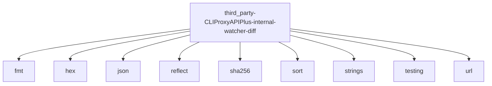

# Imports

[← Back to MODULE](MODULE.md) | [← Back to INDEX](../../INDEX.md)

## Dependency Graph

## Internal Dependencies

Dependencies within this module:

- `config`

## External Dependencies

Dependencies from other modules:

- `fmt`
- `hex`
- `json`
- `reflect`
- `sha256`
- `sort`
- `strings`
- `testing`
- `url`

