# Imports

[← Back to MODULE](MODULE.md) | [← Back to INDEX](../../INDEX.md)

## Dependency Graph

```mermaid
graph TD
    third_party_CLIProxyAPIPlus_internal_watcher_synthesizer[third_party-CLIProxyAPIPlus-internal-watcher-synthesizer] --> codex[codex]
    third_party_CLIProxyAPIPlus_internal_watcher_synthesizer[third_party-CLIProxyAPIPlus-internal-watcher-synthesizer] --> diff[diff]
    third_party_CLIProxyAPIPlus_internal_watcher_synthesizer[third_party-CLIProxyAPIPlus-internal-watcher-synthesizer] --> filepath[filepath]
    third_party_CLIProxyAPIPlus_internal_watcher_synthesizer[third_party-CLIProxyAPIPlus-internal-watcher-synthesizer] --> fmt[fmt]
    third_party_CLIProxyAPIPlus_internal_watcher_synthesizer[third_party-CLIProxyAPIPlus-internal-watcher-synthesizer] --> geminicli[geminicli]
    third_party_CLIProxyAPIPlus_internal_watcher_synthesizer[third_party-CLIProxyAPIPlus-internal-watcher-synthesizer] --> hex[hex]
    third_party_CLIProxyAPIPlus_internal_watcher_synthesizer[third_party-CLIProxyAPIPlus-internal-watcher-synthesizer] --> json[json]
    third_party_CLIProxyAPIPlus_internal_watcher_synthesizer[third_party-CLIProxyAPIPlus-internal-watcher-synthesizer] --> os[os]
    third_party_CLIProxyAPIPlus_internal_watcher_synthesizer[third_party-CLIProxyAPIPlus-internal-watcher-synthesizer] --> reflect[reflect]
    third_party_CLIProxyAPIPlus_internal_watcher_synthesizer[third_party-CLIProxyAPIPlus-internal-watcher-synthesizer] --> runtime[runtime]
    third_party_CLIProxyAPIPlus_internal_watcher_synthesizer[third_party-CLIProxyAPIPlus-internal-watcher-synthesizer] --> sha256[sha256]
    third_party_CLIProxyAPIPlus_internal_watcher_synthesizer[third_party-CLIProxyAPIPlus-internal-watcher-synthesizer] --> sort[sort]
    third_party_CLIProxyAPIPlus_internal_watcher_synthesizer[third_party-CLIProxyAPIPlus-internal-watcher-synthesizer] --> strconv[strconv]
    third_party_CLIProxyAPIPlus_internal_watcher_synthesizer[third_party-CLIProxyAPIPlus-internal-watcher-synthesizer] --> strings[strings]
    third_party_CLIProxyAPIPlus_internal_watcher_synthesizer[third_party-CLIProxyAPIPlus-internal-watcher-synthesizer] --> testing[testing]
    third_party_CLIProxyAPIPlus_internal_watcher_synthesizer[third_party-CLIProxyAPIPlus-internal-watcher-synthesizer] --> time[time]
```

## Internal Dependencies

Dependencies within this module:

- `config`

## External Dependencies

Dependencies from other modules:

- `codex`
- `diff`
- `filepath`
- `fmt`
- `geminicli`
- `hex`
- `json`
- `os`
- `reflect`
- `runtime`
- `sha256`
- `sort`
- `strconv`
- `strings`
- `testing`
- `time`

