# Imports

[← Back to MODULE](MODULE.md) | [← Back to INDEX](../../INDEX.md)

## Dependency Graph

```mermaid
graph TD
    third_party_CLIProxyAPIPlus_internal_watcher[third_party-CLIProxyAPIPlus-internal-watcher] --> atomic[atomic]
    third_party_CLIProxyAPIPlus_internal_watcher[third_party-CLIProxyAPIPlus-internal-watcher] --> context[context]
    third_party_CLIProxyAPIPlus_internal_watcher[third_party-CLIProxyAPIPlus-internal-watcher] --> diff[diff]
    third_party_CLIProxyAPIPlus_internal_watcher[third_party-CLIProxyAPIPlus-internal-watcher] --> filepath[filepath]
    third_party_CLIProxyAPIPlus_internal_watcher[third_party-CLIProxyAPIPlus-internal-watcher] --> fmt[fmt]
    third_party_CLIProxyAPIPlus_internal_watcher[third_party-CLIProxyAPIPlus-internal-watcher] --> fsnotify[fsnotify]
    third_party_CLIProxyAPIPlus_internal_watcher[third_party-CLIProxyAPIPlus-internal-watcher] --> hex[hex]
    third_party_CLIProxyAPIPlus_internal_watcher[third_party-CLIProxyAPIPlus-internal-watcher] --> json[json]
    third_party_CLIProxyAPIPlus_internal_watcher[third_party-CLIProxyAPIPlus-internal-watcher] --> os[os]
    third_party_CLIProxyAPIPlus_internal_watcher[third_party-CLIProxyAPIPlus-internal-watcher] --> reflect[reflect]
    third_party_CLIProxyAPIPlus_internal_watcher[third_party-CLIProxyAPIPlus-internal-watcher] --> registry[registry]
    third_party_CLIProxyAPIPlus_internal_watcher[third_party-CLIProxyAPIPlus-internal-watcher] --> runtime[runtime]
    third_party_CLIProxyAPIPlus_internal_watcher[third_party-CLIProxyAPIPlus-internal-watcher] --> sha256[sha256]
    third_party_CLIProxyAPIPlus_internal_watcher[third_party-CLIProxyAPIPlus-internal-watcher] --> strings[strings]
    third_party_CLIProxyAPIPlus_internal_watcher[third_party-CLIProxyAPIPlus-internal-watcher] --> sync[sync]
    third_party_CLIProxyAPIPlus_internal_watcher[third_party-CLIProxyAPIPlus-internal-watcher] --> synthesizer[synthesizer]
    third_party_CLIProxyAPIPlus_internal_watcher[third_party-CLIProxyAPIPlus-internal-watcher] --> testing[testing]
    third_party_CLIProxyAPIPlus_internal_watcher[third_party-CLIProxyAPIPlus-internal-watcher] --> time[time]
    third_party_CLIProxyAPIPlus_internal_watcher[third_party-CLIProxyAPIPlus-internal-watcher] --> util[util]
    third_party_CLIProxyAPIPlus_internal_watcher[third_party-CLIProxyAPIPlus-internal-watcher] --> yaml_v3[yaml.v3]
```

## Internal Dependencies

Dependencies within this module:

- `config`

## External Dependencies

Dependencies from other modules:

- `atomic`
- `context`
- `diff`
- `filepath`
- `fmt`
- `fsnotify`
- `hex`
- `json`
- `os`
- `reflect`
- `registry`
- `runtime`
- `sha256`
- `strings`
- `sync`
- `synthesizer`
- `testing`
- `time`
- `util`
- `yaml.v3`

