# Imports

[← Back to MODULE](MODULE.md) | [← Back to INDEX](../../INDEX.md)

## Dependency Graph

```mermaid
graph TD
    third_party_CLIProxyAPIPlus_sdk_api_handlers[third_party-CLIProxyAPIPlus-sdk-api-handlers] --> bytes[bytes]
    third_party_CLIProxyAPIPlus_sdk_api_handlers[third_party-CLIProxyAPIPlus-sdk-api-handlers] --> config[config]
    third_party_CLIProxyAPIPlus_sdk_api_handlers[third_party-CLIProxyAPIPlus-sdk-api-handlers] --> context[context]
    third_party_CLIProxyAPIPlus_sdk_api_handlers[third_party-CLIProxyAPIPlus-sdk-api-handlers] --> errors[errors]
    third_party_CLIProxyAPIPlus_sdk_api_handlers[third_party-CLIProxyAPIPlus-sdk-api-handlers] --> fmt[fmt]
    third_party_CLIProxyAPIPlus_sdk_api_handlers[third_party-CLIProxyAPIPlus-sdk-api-handlers] --> gin[gin]
    third_party_CLIProxyAPIPlus_sdk_api_handlers[third_party-CLIProxyAPIPlus-sdk-api-handlers] --> http[http]
    third_party_CLIProxyAPIPlus_sdk_api_handlers[third_party-CLIProxyAPIPlus-sdk-api-handlers] --> httptest[httptest]
    third_party_CLIProxyAPIPlus_sdk_api_handlers[third_party-CLIProxyAPIPlus-sdk-api-handlers] --> interfaces[interfaces]
    third_party_CLIProxyAPIPlus_sdk_api_handlers[third_party-CLIProxyAPIPlus-sdk-api-handlers] --> json[json]
    third_party_CLIProxyAPIPlus_sdk_api_handlers[third_party-CLIProxyAPIPlus-sdk-api-handlers] --> logging[logging]
    third_party_CLIProxyAPIPlus_sdk_api_handlers[third_party-CLIProxyAPIPlus-sdk-api-handlers] --> reflect[reflect]
    third_party_CLIProxyAPIPlus_sdk_api_handlers[third_party-CLIProxyAPIPlus-sdk-api-handlers] --> registry[registry]
    third_party_CLIProxyAPIPlus_sdk_api_handlers[third_party-CLIProxyAPIPlus-sdk-api-handlers] --> strings[strings]
    third_party_CLIProxyAPIPlus_sdk_api_handlers[third_party-CLIProxyAPIPlus-sdk-api-handlers] --> sync[sync]
    third_party_CLIProxyAPIPlus_sdk_api_handlers[third_party-CLIProxyAPIPlus-sdk-api-handlers] --> testing[testing]
    third_party_CLIProxyAPIPlus_sdk_api_handlers[third_party-CLIProxyAPIPlus-sdk-api-handlers] --> thinking[thinking]
    third_party_CLIProxyAPIPlus_sdk_api_handlers[third_party-CLIProxyAPIPlus-sdk-api-handlers] --> time[time]
    third_party_CLIProxyAPIPlus_sdk_api_handlers[third_party-CLIProxyAPIPlus-sdk-api-handlers] --> util[util]
    third_party_CLIProxyAPIPlus_sdk_api_handlers[third_party-CLIProxyAPIPlus-sdk-api-handlers] --> uuid[uuid]
```

## External Dependencies

Dependencies from other modules:

- `bytes`
- `config`
- `context`
- `errors`
- `fmt`
- `gin`
- `http`
- `httptest`
- `interfaces`
- `json`
- `logging`
- `reflect`
- `registry`
- `strings`
- `sync`
- `testing`
- `thinking`
- `time`
- `util`
- `uuid`

