# Imports

[← Back to MODULE](MODULE.md) | [← Back to INDEX](../../INDEX.md)

## Dependency Graph

```mermaid
graph TD
    third_party_CLIProxyAPIPlus_sdk_auth[third_party-CLIProxyAPIPlus-sdk-auth] --> browser[browser]
    third_party_CLIProxyAPIPlus_sdk_auth[third_party-CLIProxyAPIPlus-sdk-auth] --> bytes[bytes]
    third_party_CLIProxyAPIPlus_sdk_auth[third_party-CLIProxyAPIPlus-sdk-auth] --> config[config]
    third_party_CLIProxyAPIPlus_sdk_auth[third_party-CLIProxyAPIPlus-sdk-auth] --> context[context]
    third_party_CLIProxyAPIPlus_sdk_auth[third_party-CLIProxyAPIPlus-sdk-auth] --> filepath[filepath]
    third_party_CLIProxyAPIPlus_sdk_auth[third_party-CLIProxyAPIPlus-sdk-auth] --> fmt[fmt]
    third_party_CLIProxyAPIPlus_sdk_auth[third_party-CLIProxyAPIPlus-sdk-auth] --> fs[fs]
    third_party_CLIProxyAPIPlus_sdk_auth[third_party-CLIProxyAPIPlus-sdk-auth] --> hex[hex]
    third_party_CLIProxyAPIPlus_sdk_auth[third_party-CLIProxyAPIPlus-sdk-auth] --> http[http]
    third_party_CLIProxyAPIPlus_sdk_auth[third_party-CLIProxyAPIPlus-sdk-auth] --> httptest[httptest]
    third_party_CLIProxyAPIPlus_sdk_auth[third_party-CLIProxyAPIPlus-sdk-auth] --> io[io]
    third_party_CLIProxyAPIPlus_sdk_auth[third_party-CLIProxyAPIPlus-sdk-auth] --> json[json]
    third_party_CLIProxyAPIPlus_sdk_auth[third_party-CLIProxyAPIPlus-sdk-auth] --> misc[misc]
    third_party_CLIProxyAPIPlus_sdk_auth[third_party-CLIProxyAPIPlus-sdk-auth] --> net[net]
    third_party_CLIProxyAPIPlus_sdk_auth[third_party-CLIProxyAPIPlus-sdk-auth] --> os[os]
    third_party_CLIProxyAPIPlus_sdk_auth[third_party-CLIProxyAPIPlus-sdk-auth] --> runtime[runtime]
    third_party_CLIProxyAPIPlus_sdk_auth[third_party-CLIProxyAPIPlus-sdk-auth] --> sha256[sha256]
    third_party_CLIProxyAPIPlus_sdk_auth[third_party-CLIProxyAPIPlus-sdk-auth] --> strconv[strconv]
    third_party_CLIProxyAPIPlus_sdk_auth[third_party-CLIProxyAPIPlus-sdk-auth] --> strings[strings]
    third_party_CLIProxyAPIPlus_sdk_auth[third_party-CLIProxyAPIPlus-sdk-auth] --> sync[sync]
    third_party_CLIProxyAPIPlus_sdk_auth[third_party-CLIProxyAPIPlus-sdk-auth] --> testing[testing]
    third_party_CLIProxyAPIPlus_sdk_auth[third_party-CLIProxyAPIPlus-sdk-auth] --> time[time]
    third_party_CLIProxyAPIPlus_sdk_auth[third_party-CLIProxyAPIPlus-sdk-auth] --> url[url]
    third_party_CLIProxyAPIPlus_sdk_auth[third_party-CLIProxyAPIPlus-sdk-auth] --> util[util]
```

## Internal Dependencies

Dependencies within this module:

- `antigravity`
- `claude`
- `codex`
- `copilot`
- `errors`
- `gemini`
- `iflow`
- `interfaces`
- `kilo`
- `kimi`
- `qwen`

## External Dependencies

Dependencies from other modules:

- `browser`
- `bytes`
- `config`
- `context`
- `filepath`
- `fmt`
- `fs`
- `hex`
- `http`
- `httptest`
- `io`
- `json`
- `misc`
- `net`
- `os`
- `runtime`
- `sha256`
- `strconv`
- `strings`
- `sync`
- `testing`
- `time`
- `url`
- `util`

