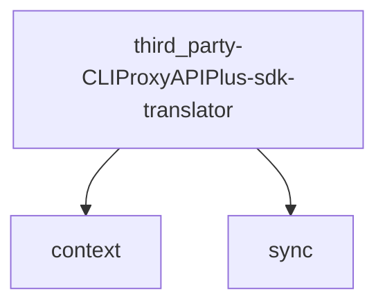

# Module: third_party/CLIProxyAPIPlus/sdk/translator

[← Back to INDEX](../../INDEX.md)

**Type:** implicit | **Files:** 6

## Files

| File | Lines | Large |
| ---- | ----- | ----- |
| `third_party/CLIProxyAPIPlus/sdk/translator/format.go` | 14 |  |
| `third_party/CLIProxyAPIPlus/sdk/translator/formats.go` | 12 |  |
| `third_party/CLIProxyAPIPlus/sdk/translator/helpers.go` | 28 |  |
| `third_party/CLIProxyAPIPlus/sdk/translator/pipeline.go` | 106 |  |
| `third_party/CLIProxyAPIPlus/sdk/translator/registry.go` | 142 |  |
| `third_party/CLIProxyAPIPlus/sdk/translator/types.go` | 34 |  |

---

## External Dependencies

Dependencies from other modules:

- `context`
- `sync`
