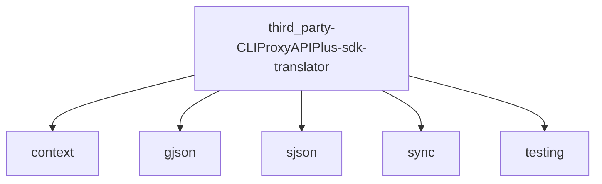

# Imports

[← Back to MODULE](MODULE.md) | [← Back to INDEX](../../INDEX.md)

## Dependency Graph

## Internal Dependencies

Dependencies within this module:

- `bytes`

## External Dependencies

Dependencies from other modules:

- `context`
- `gjson`
- `sjson`
- `sync`
- `testing`

