# Imports

[← Back to MODULE](MODULE.md) | [← Back to INDEX](../../INDEX.md)

## Dependency Graph

```mermaid
graph TD
    third_party_CLIProxyAPIPlus_test[third_party-CLIProxyAPIPlus-test] --> bytes[bytes]
    third_party_CLIProxyAPIPlus_test[third_party-CLIProxyAPIPlus-test] --> config[config]
    third_party_CLIProxyAPIPlus_test[third_party-CLIProxyAPIPlus-test] --> context[context]
    third_party_CLIProxyAPIPlus_test[third_party-CLIProxyAPIPlus-test] --> filepath[filepath]
    third_party_CLIProxyAPIPlus_test[third_party-CLIProxyAPIPlus-test] --> fmt[fmt]
    third_party_CLIProxyAPIPlus_test[third_party-CLIProxyAPIPlus-test] --> gjson[gjson]
    third_party_CLIProxyAPIPlus_test[third_party-CLIProxyAPIPlus-test] --> http[http]
    third_party_CLIProxyAPIPlus_test[third_party-CLIProxyAPIPlus-test] --> httptest[httptest]
    third_party_CLIProxyAPIPlus_test[third_party-CLIProxyAPIPlus-test] --> json[json]
    third_party_CLIProxyAPIPlus_test[third_party-CLIProxyAPIPlus-test] --> os[os]
    third_party_CLIProxyAPIPlus_test[third_party-CLIProxyAPIPlus-test] --> strings[strings]
    third_party_CLIProxyAPIPlus_test[third_party-CLIProxyAPIPlus-test] --> testing[testing]
    third_party_CLIProxyAPIPlus_test[third_party-CLIProxyAPIPlus-test] --> time[time]
```

## Internal Dependencies

Dependencies within this module:

- `gin`
- `management`

## External Dependencies

Dependencies from other modules:

- `bytes`
- `config`
- `context`
- `filepath`
- `fmt`
- `gjson`
- `http`
- `httptest`
- `json`
- `os`
- `strings`
- `testing`
- `time`

