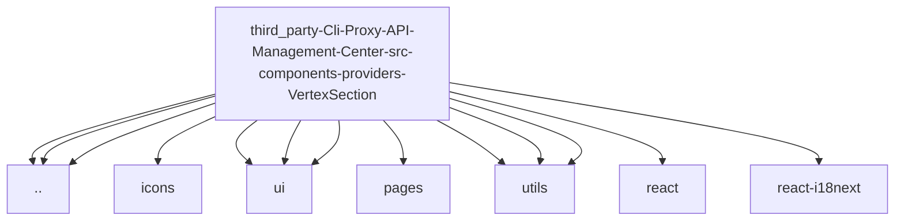

# Imports

[← Back to MODULE](MODULE.md) | [← Back to INDEX](../../INDEX.md)

## Dependency Graph

## External Dependencies

Dependencies from other modules:

- `../ProviderList`
- `../ProviderStatusBar`
- `../utils`
- `@/assets/icons/vertex.svg`
- `@/components/ui/Button`
- `@/components/ui/Card`
- `@/components/ui/ToggleSwitch`
- `@/pages/AiProvidersPage.module.scss`
- `@/utils/format`
- `@/utils/usage`
- `@/utils/usageIndex`
- `react`
- `react-i18next`

