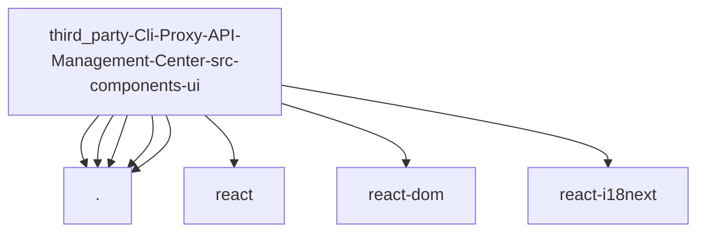

# Imports

[← Back to MODULE](MODULE.md) | [← Back to INDEX](../../INDEX.md)

## Dependency Graph

## External Dependencies

Dependencies from other modules:

- `./Button`
- `./Select.module.scss`
- `./SelectionCheckbox.module.scss`
- `./ToggleSwitch.module.scss`
- `./icons`
- `react`
- `react-dom`
- `react-i18next`

