# Imports

[← Back to MODULE](MODULE.md) | [← Back to INDEX](../../INDEX.md)

## Dependency Graph

```mermaid
graph TD
    third_party_Cli_Proxy_API_Management_Center_src_components_usage[third_party-Cli-Proxy-API-Management-Center-src-components-usage] --> ui[ui]
    third_party_Cli_Proxy_API_Management_Center_src_components_usage[third_party-Cli-Proxy-API-Management-Center-src-components-usage] --> ui[ui]
    third_party_Cli_Proxy_API_Management_Center_src_components_usage[third_party-Cli-Proxy-API-Management-Center-src-components-usage] --> ui[ui]
    third_party_Cli_Proxy_API_Management_Center_src_components_usage[third_party-Cli-Proxy-API-Management-Center-src-components-usage] --> ui[ui]
    third_party_Cli_Proxy_API_Management_Center_src_components_usage[third_party-Cli-Proxy-API-Management-Center-src-components-usage] --> ui[ui]
    third_party_Cli_Proxy_API_Management_Center_src_components_usage[third_party-Cli-Proxy-API-Management-Center-src-components-usage] --> ui[ui]
    third_party_Cli_Proxy_API_Management_Center_src_components_usage[third_party-Cli-Proxy-API-Management-Center-src-components-usage] --> ui[ui]
    third_party_Cli_Proxy_API_Management_Center_src_components_usage[third_party-Cli-Proxy-API-Management-Center-src-components-usage] --> pages[pages]
    third_party_Cli_Proxy_API_Management_Center_src_components_usage[third_party-Cli-Proxy-API-Management-Center-src-components-usage] --> api[api]
    third_party_Cli_Proxy_API_Management_Center_src_components_usage[third_party-Cli-Proxy-API-Management-Center-src-components-usage] --> utils[utils]
    third_party_Cli_Proxy_API_Management_Center_src_components_usage[third_party-Cli-Proxy-API-Management-Center-src-components-usage] --> utils[utils]
    third_party_Cli_Proxy_API_Management_Center_src_components_usage[third_party-Cli-Proxy-API-Management-Center-src-components-usage] --> utils[utils]
    third_party_Cli_Proxy_API_Management_Center_src_components_usage[third_party-Cli-Proxy-API-Management-Center-src-components-usage] --> usage[usage]
    third_party_Cli_Proxy_API_Management_Center_src_components_usage[third_party-Cli-Proxy-API-Management-Center-src-components-usage] --> react[react]
    third_party_Cli_Proxy_API_Management_Center_src_components_usage[third_party-Cli-Proxy-API-Management-Center-src-components-usage] --> react_chartjs_2[react-chartjs-2]
    third_party_Cli_Proxy_API_Management_Center_src_components_usage[third_party-Cli-Proxy-API-Management-Center-src-components-usage] --> react_dom[react-dom]
    third_party_Cli_Proxy_API_Management_Center_src_components_usage[third_party-Cli-Proxy-API-Management-Center-src-components-usage] --> react_i18next[react-i18next]
```

## External Dependencies

Dependencies from other modules:

- `@/components/ui/Button`
- `@/components/ui/Card`
- `@/components/ui/EmptyState`
- `@/components/ui/Input`
- `@/components/ui/Modal`
- `@/components/ui/Select`
- `@/components/ui/icons`
- `@/pages/UsagePage.module.scss`
- `@/services/api/authFiles`
- `@/utils/download`
- `@/utils/sourceResolver`
- `@/utils/usage`
- `@/utils/usage/chartConfig`
- `react`
- `react-chartjs-2`
- `react-dom`
- `react-i18next`

