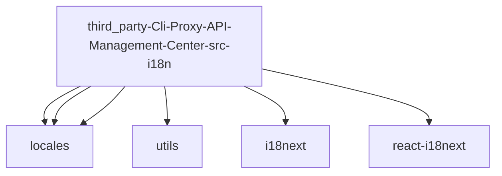

# Imports

[← Back to MODULE](MODULE.md) | [← Back to INDEX](../../INDEX.md)

## Dependency Graph

## External Dependencies

Dependencies from other modules:

- `./locales/en.json`
- `./locales/ru.json`
- `./locales/zh-CN.json`
- `@/utils/language`
- `i18next`
- `react-i18next`

