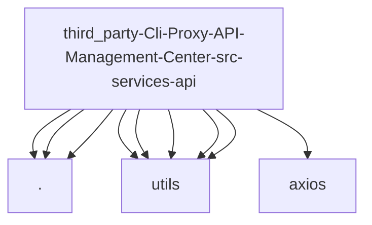

# Imports

[← Back to MODULE](MODULE.md) | [← Back to INDEX](../../INDEX.md)

## Dependency Graph

## External Dependencies

Dependencies from other modules:

- `./apiCall`
- `./client`
- `./transformers`
- `@/utils/connection`
- `@/utils/constants`
- `@/utils/headers`
- `@/utils/models`
- `@/utils/usage`
- `axios`

