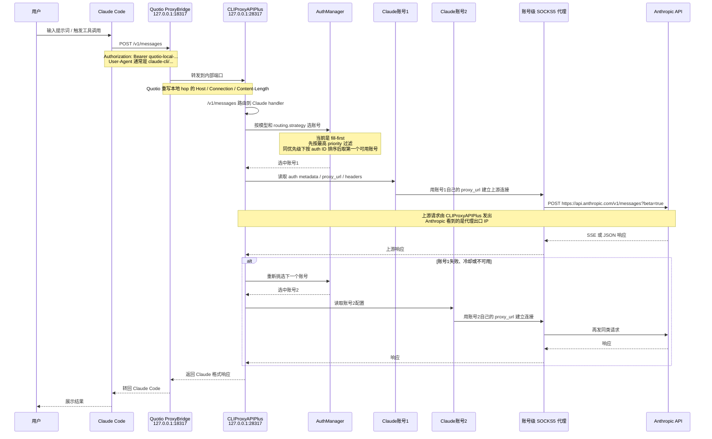
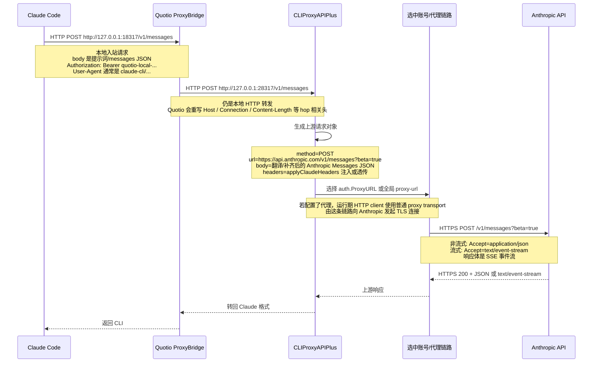

# Claude 请求链路与指纹边界

最后核对时间：2026-03-20 18:25

## 已确认的运行时快照

- Quotio 下载和升级的代理仓库是 `router-for-me/CLIProxyAPIPlus`，本地落地二进制文件名仍为 `CLIProxyAPI`
- 当前运行中的代理二进制版本为 `6.8.52-1-plus`
- Claude Code 本地入口配置为 `ANTHROPIC_BASE_URL=http://127.0.0.1:18317`
- CLIProxyAPIPlus 当前实际监听在 `127.0.0.1:28317`
- Claude OAuth 账号文件位于 `~/.cli-proxy-api/*.json`，当前账号记录里带有各自的 `proxy_url`
- 当前代理配置 `routing.strategy` 为 `fill-first`

## Claude 请求链路

## HTTP 视角的实际请求对象

## 哪一跳才是“真正提交提示词到 Claude 服务器”

- 是 `CLIProxyAPIPlus -> Anthropic API` 这一跳
- 本质上是标准 `HTTPS POST https://api.anthropic.com/v1/messages`
- 如果是流式输出，仍然是 HTTP，只是响应体类型变成 `text/event-stream`，也就是 SSE
- `Claude Code -> Quotio -> CLIProxyAPIPlus` 这两跳只是本地 HTTP 入站和桥接，不是 Anthropic 实际看到的上游请求

## 对“账号指纹”需求的业务解释

- 如果目标是区分不同 Claude 账号在 Anthropic 侧看到的请求特征，应该优先关注 `账号级代理出口 IP + 上游 HTTP 头`
- 本地 `Claude Code -> Quotio` 这一跳的 CLI 入站头，只能说明本机客户端长什么样，不能代表 Anthropic 实际看到的上游指纹
- 因此 `headers.User-Agent`、`X-Stainless-*` 这类上游头，才属于可用于验收的“HTTP 指纹”；本地 CLI 入站头不应当作为最终验收对象
- 若后续还要追求更强隔离，再评估运行期 TLS ClientHello；但这已经是核心 transport 能力，不是单纯在 Quotio 页面里保存一份“SSL 指纹档案”就能成立

## 指纹与出口结论

- 真正访问 Anthropic 的不是 Claude Code，而是 CLIProxyAPIPlus 的 Claude executor
- Anthropic 看到的出口 IP 优先取决于所选账号的 `proxy_url`
- 若账号未设置 `proxy_url`，才会退回全局 `proxy-url`
- 上游 HTTP header 主要在 `internal/runtime/executor/claude_executor.go` 的 `applyClaudeHeaders` 中生成
- 当前实测上游日志已看到标准 HTTP 形态的字段：`Method: POST`、`URL: /v1/messages?beta=true`、`Content-Type: application/json`、`Accept: application/json`，以及 Claude 风格的 `User-Agent`、`X-Stainless-*`、`Anthropic-*` 头
- `User-Agent` 默认伪装成 `claude-cli/2.1.63 (external, cli)`；如果下游本来就是 Claude Code，也会直接透传下游 `User-Agent`
- 账号级自定义 header 可通过 auth JSON 的 `headers` 字段进入运行时 `header:*`；但是否真实进入上游请求，取决于当前运行中的 CLIProxyAPIPlus 内核是否已包含这条桥接逻辑
- 运行期真正发起上游 TLS 的，是 `newProxyAwareHTTPClient(...)` 最终选中的 transport
- 在当前这套实测环境里，Claude 账号都配置了 `proxy_url`，所以运行期优先走普通代理 transport；实际对 Anthropic 建链的是代理链路，而不是 OAuth 那套 `uTLS` RoundTripper
- 只有在账号级 `proxy_url` 和全局 `proxy-url` 都为空时，运行期才会回落到 context 里的 `cliproxy.roundtripper`
- `uTLS HelloChrome_Auto` 已确认存在于 Claude OAuth 登录和 refresh 代码路径；它不能直接等同于“当前模型请求一定也走了同一套 uTLS”

## 可修改项

- 可以改：每个 Claude 账号的 `proxy_url`
- 可以改：每个 Claude 账号的 `headers.User-Agent` 以及其他自定义 header
- 可以改：全局 `proxy-url`
- 不可直接通过 Quotio 配置改：运行期模型请求的 TLS ClientHello 指纹
- 若要改运行期 TLS 指纹，需要修改 CLIProxyAPIPlus 运行期 executor / transport 实现，或者让运行期明确走一个可控的自定义 RoundTripper

## 可修改面矩阵

| 关注项 | Anthropic 最终是否看得到 | 当前由哪一层发出/决定 | 现在能否改 | 主要改动入口 |
|---|---|---|---|---|
| 选中哪个 Claude 账号 | 间接能看出来 | CLIProxyAPIPlus 的 selector / auth manager | 能 | `routing.strategy`、账号 `priority`、账号可用性 |
| 出口 IP | 能 | 选中账号的 `proxy_url`；为空时退回全局 `proxy-url` | 能 | auth JSON 的 `proxy_url`，或 CLIProxyAPIPlus 全局配置 |
| 上游 `User-Agent` | 能 | `applyClaudeHeaders(...)`；可被 Claude Code 下游头或 `header:*` 覆盖 | 能 | 账号 `headers.User-Agent`、全局 `ClaudeHeaderDefaults`、下游 Claude Code 自带头 |
| 上游其他 HTTP 头 | 能 | `applyClaudeHeaders(...)` 生成默认头，再叠加/透传自定义头 | 部分能 | 账号 `headers.*`、全局 header defaults、下游透传头 |
| 提示词 / messages body | 能 | CLIProxyAPIPlus 在转 Anthropic 前生成的 `POST /v1/messages` body | 能 | 用户输入、Claude Code 生成内容、CLIProxyAPIPlus body 翻译/补丁逻辑 |
| 流式还是非流式 | 能 | CLIProxyAPIPlus 发上游请求时决定 `Accept`，Anthropic 用 JSON 或 SSE 返回 | 能 | 调用方式、上游 executor 行为 |
| 本地 CLI 入站头 | 不能 | Claude Code -> Quotio 这段本地 HTTP 请求 | 能，但对 Anthropic 无意义 | 本地 CLI / 本地 bridge |
| 运行期 TLS ClientHello 指纹 | 能 | 真正对 Anthropic 建 TLS 的 transport | 默认不能按账号直接改 | 需要修改 CLIProxyAPIPlus 运行期 transport / executor |
| OAuth 登录/refresh 的 TLS 指纹 | 只影响 OAuth | Claude OAuth 专用 `uTLS HelloChrome_Auto` 客户端 | 通常不能从 Quotio 页面改 | 需要改 OAuth 客户端实现 |

## 怎么判断“该改哪一层”

- 如果你关心的是 Anthropic 最终看到什么，优先看 `CLIProxyAPIPlus -> Anthropic` 这一跳。
- 如果你关心的是某个 Claude 账号走哪个出口 IP，看账号 `proxy_url`，不要看本机公网 IP。
- 如果你关心的是 `User-Agent`、`X-Stainless-*`、`Anthropic-*` 这类头，看运行期 executor 生成的上游请求，不要看本地 CLI 入站请求。
- 如果你关心的是 TLS 指纹，要先区分“OAuth 阶段”还是“模型请求阶段”；这两条链路不是同一个 transport。

## 这份结论依赖的证据

- 本地源码：`internal/runtime/executor/claude_executor.go` 明确构造 `POST {baseURL}/v1/messages?beta=true`
- 本地源码：`internal/runtime/executor/proxy_helpers.go` 明确 `auth.ProxyURL > cfg.ProxyURL > context roundtripper` 的优先级
- 本地源码：`internal/auth/claude/utls_transport.go` 明确 OAuth 客户端使用 `uTLS HelloChrome_Auto`
- 本地实测日志：`~/.cli-proxy-api-dev/logs/v1-messages-2026-03-20T180631-989d49a6.log` 已记录一条真实上游 `POST /v1/messages?beta=true` 请求和 `text/event-stream` 响应
- Anthropic 官方 Messages API 文档：`POST /v1/messages`
- Anthropic 官方 streaming 文档：流式返回使用 SSE
- Claude Code 官方 troubleshooting：支持通过代理或可替换基址工作

## 对应源码位置

- Quotio 本地客户端入口：`Quotio/Services/AgentConfigurationService.swift`
- Quotio 本地桥接层：`Quotio/Services/Proxy/ProxyBridge.swift`
- CLIProxyAPIPlus selector 初始化：`sdk/cliproxy/builder.go`
- CLIProxyAPIPlus 配置热更新切换 selector：`sdk/cliproxy/service.go`
- Claude handler：`sdk/api/handlers/claude/code_handlers.go`
- Claude 运行期 header 注入：`internal/runtime/executor/claude_executor.go`
- 上游代理优先级：`internal/runtime/executor/proxy_helpers.go`
- 账号级代理 transport：`sdk/cliproxy/rtprovider.go`
- OAuth 阶段 uTLS：`internal/auth/claude/anthropic_auth.go`、`internal/auth/claude/utls_transport.go`
