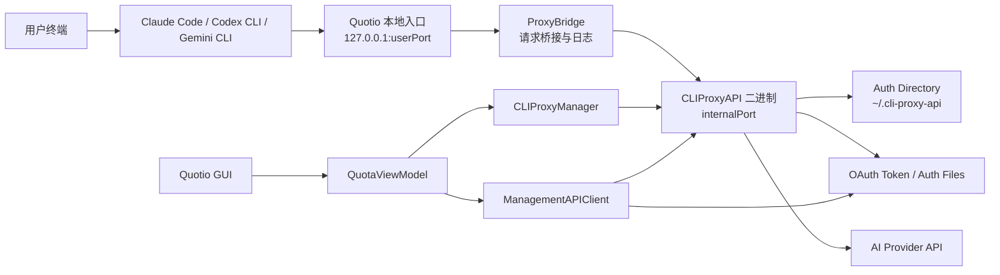
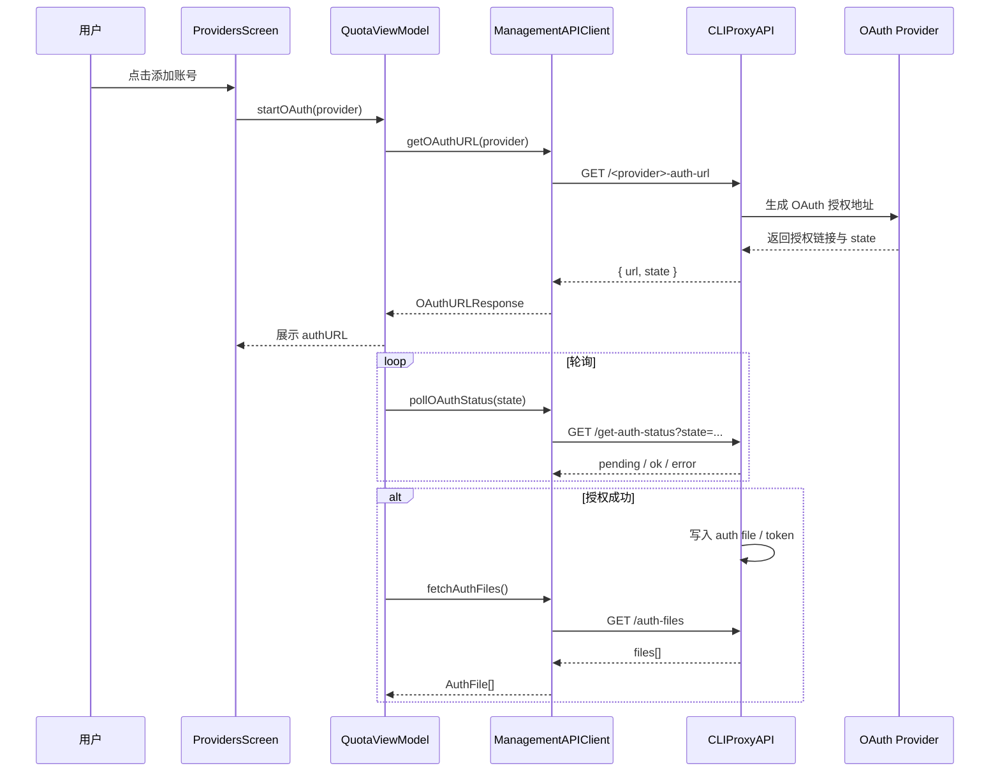
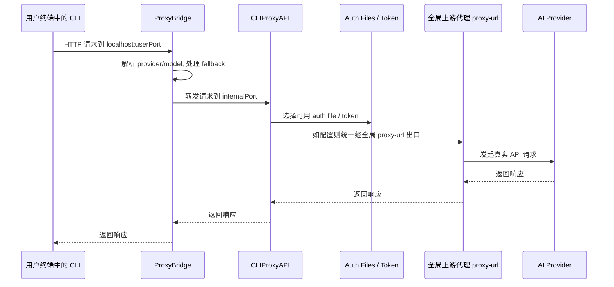

# OAuth 账号与请求链路现状分析

## 目的

本文用于回答一个核心问题：当前 Quotio 从用户 CLI 请求到 OAuth 账号，再到 AI 提供商的整条链路究竟怎么跑，以及“代理 / UA / TLS 指纹”今天落在什么层级。

结论先行：

- 当前系统已经具备“账号级 OAuth 认证与 token 管理”能力。
- 当前系统没有“账号级运行身份包”能力。
- 当前上游代理配置是全局单例，不是按账号绑定。
- 当前请求日志能看到 provider / model / 状态码，但不能证明某个 OAuth 账号实际使用了哪套代理 / UA / TLS。

## 当前系统的关键构件

### 1. App 与主状态

- `QuotaViewModel` 负责总代码路径上的状态协调，包括代理启动、OAuth 发起、auth files 刷新、quota 拉取、请求跟踪接线。
- `QuotioApp` 通过 `NavigationSplitView` 提供主界面导航，`Providers`、`Settings`、`Agents` 都挂在这层。

### 2. 本地代理层

- `CLIProxyManager` 负责启动和停止外部二进制 `CLIProxyAPI`。
- 启动前会把本地 `config.yaml` 写好，包括：
  - `auth-dir`
  - `proxy-url`
  - `routing.strategy`
  - `remote-management.secret-key`
- 当启用 bridge mode 时，外部 CLI 不直接连 `CLIProxyAPI`，而是先连本进程内的 `ProxyBridge`。

### 3. 请求桥接层

- `ProxyBridge` 的职责是：
  - 接收 CLI 发往本地代理的 HTTP 请求
  - 转发给真实 `CLIProxyAPI`
  - 强制 `Connection: close`
  - 做 fallback 模型替换
  - 记录请求元数据给 `RequestTracker`
- `ProxyBridge` 现在只看请求 path / body 推断 provider 和 model，不知道 auth file、auth index、账号邮箱、绑定指纹。

### 4. 管理 API 层

- `ManagementAPIClient` 通过 `CLIProxyAPI` 的 management API 访问：
  - `/auth-files`
  - `/usage`
  - `/logs`
  - OAuth URL / OAuth 状态轮询
  - `/proxy-url`
  - `/routing/strategy`
  - `/api-call`
- 这里能看到一个重要能力：`APICallRequest` 支持传 `auth_index`，说明底层管理 API 已经能“按指定账号”发请求。

### 5. OAuth 账号表示

- UI 里的账号主要对应 management API 返回的 `AuthFile`。
- `AuthFile` 里包含：
  - `provider`
  - `name`
  - `email`
  - `account`
  - `auth_index`
- 这说明当前系统内部已经有“账号索引”的概念，但主要用于 quota / warmup / 管理操作，不是运行身份绑定。

### 6. CLI 接入层

- `AgentSetupViewModel` + `AgentConfigurationService` 会把 Claude Code、Codex CLI、Gemini CLI 等工具配置到本地 Quotio 代理地址。
- 典型结果是：
  - Claude Code 写 `ANTHROPIC_BASE_URL=http://127.0.0.1:<port>`
  - Codex CLI 写 `base_url=http://127.0.0.1:<port>/v1`
  - Gemini CLI 写 `CODE_ASSIST_ENDPOINT=http://127.0.0.1:<port>`

## 当前链路的真实形态

### 端到端组件图

### OAuth 建立时序

### 用户请求时序

## 代码层面的关键事实

### 1. 代理是“全局配置”

`CLIProxyManager.ensureConfigExists()` 生成的 `config.yaml` 只有一个：

- `proxy-url`
- `routing.strategy`

没有任何“auth file -> proxy / ua / tls profile”的映射结构。

### 2. 设置页也是“单一上游代理”

`SettingsScreen` 当前只暴露：

- 一个 `upstream proxy` 文本框
- 一个全局 `routing strategy`

这进一步说明现在的产品模型是“整个代理实例共用一个出口策略”。

### 3. OAuth 账号虽然有 `auth_index`，但普通流量没有绑定身份包

`AuthFile` 模型里有 `auth_index`，`WarmupService` 也能用 `APICallRequest(authIndex:)` 定点调用某个账号。

但这套能力目前只说明：

- 系统能知道“这是哪一个账号”
- 管理 API 能按账号做定向调用

并不等于：

- 普通 CLI 请求已经按账号绑定代理 / UA / TLS

### 4. 请求日志缺少“账号 / 指纹 / 出口”证明字段

`RequestTracker` 与 `RequestLog` 记录的是：

- provider
- model
- resolvedModel
- statusCode
- duration

没有这些字段：

- auth file name
- auth index
- account email
- runtime package id
- bound proxy endpoint
- UA fingerprint id
- TLS profile id
- 出口 IP / 验证回执

所以当前产品无法证明某个 OAuth 账号真的用了某个身份包。

## 当前设计对你需求的影响

你要的是：

- 每个 OAuth 账号强绑定一套独立且不可混用的运行身份包
- 运行身份包至少包含：代理、UA、TLS 指纹

而当前系统的限制是：

### 已有能力

- OAuth 账号能单独存在
- 账号有稳定的 `auth_index`
- 管理 API 能按 `auth_index` 发起请求

### 缺失能力

- 没有身份包数据模型
- 没有账号与身份包绑定关系
- 没有在普通流量路径上执行绑定的调度器
- 没有验证绑定是否生效的观测字段

## 当前最重要的技术风险

### 1. 最容易做的是“账号 -> 代理”绑定

因为现有系统已经支持单一 `proxy-url`，如果底层 CLIProxyAPI 支持扩展配置，最直接的增量是把它扩展成“auth_index -> proxy”。

### 2. UA 绑定次之

如果底层出站 HTTP 允许自定义 header，UA 可以设计成账号级配置。

### 3. TLS 指纹是最难的一层

严格意义上的 TLS 指纹通常不是简单 header，而是 ClientHello / cipher suites / extension order / JA3 级别控制。

这意味着：

- 若 CLIProxyAPIPlus 本身不支持 TLS profile
- 或者 Quotio 不额外引入专门的 egress 组件

那么“严格 TLS 指纹隔离”很可能无法只靠当前 SwiftUI 包装层完成。

## 我对现状的判断

当前 Quotio 更像：

- 一个本地代理管理台
- 一个 OAuth 账号管理器
- 一个 CLI 配置器
- 一个 quota / request 监控器

它还不是：

- 一个账号级 egress identity orchestration system（账号级出口身份编排系统）

所以如果要实现你的目标，真正的改造重点不会只在 UI，而在于：

1. 新增身份包领域模型
2. 新增账号绑定模型
3. 在真实出站链路中执行绑定
4. 为绑定结果提供可验证证据
