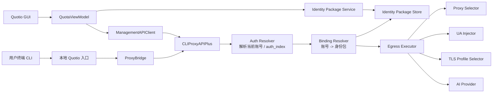
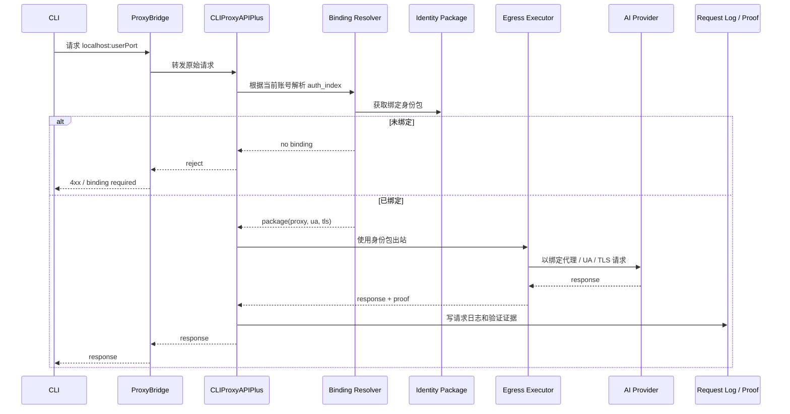

# OAuth 账号强绑定身份包目标架构与改动地图

## 文档目标

这份文档在前两份文档的基础上继续往前走两步：

1. 定义目标架构，不再停留在“需求描述”
2. 拆出本仓库内需要修改的文件和外部依赖边界

本文默认采用你已确认的约束：

- 绑定粒度是单个 OAuth 账号 / AuthFile
- 一个身份包只能绑定一个账号
- 未绑定账号禁止真实出站
- 需要可验证的代理 / UA / TLS 证据链

## 目标架构

## 1. 总体思路

目标状态下，Quotio 不再只有“账号”和“全局代理”两个概念，而是新增第三个核心概念：

- `RuntimeIdentityPackage`：运行身份包

最终形成三层关系：

- OAuth 账号层
- 身份包层
- 出站执行层

关系约束：

- 一个账号必须绑定一个身份包
- 一个身份包最多绑定一个账号
- 出站时必须根据账号绑定关系选择身份包
- 未绑定时直接拒绝请求，不允许退化到全局默认代理

## 2. 目标组件图



## 3. 目标请求时序



## 推荐实现路线

## 路线 A：CLIProxyAPIPlus 原生支持

这是推荐路线。

### 原因

- “不可混用”约束必须在真正选择 token 和真正出站的同一层执行才稳
- 管理 API 已经具备 `auth_index` 概念，天然适合往下扩
- 若身份包逻辑放在 GUI，最终只会得到“展示绑定关系”，不等于“运行时强绑定”

### 对上游代理的最低要求

需要 CLIProxyAPIPlus 新增以下能力：

- 身份包配置读写
- 账号与身份包绑定关系读写
- 在常规请求链路中解析当前请求对应的 `auth_index`
- 按绑定身份包选择：
  - 出口代理
  - UA
  - TLS profile
- 产出请求级证据

## 路线 B：本地 Egress Identity Gateway

仅作为备选路线。

### 适用场景

- 上游代理短期无法改
- 但能在某一层识别请求最终使用的账号

### 主要问题

- 当前 ProxyBridge 不知道 auth index
- 如果必须靠请求内容猜账号，强绑定就不可信
- 严格 TLS 指纹通常也不适合靠 Swift 层 HTTP 客户端做精细控制

结论：

- 除非上游代理完全不可改，否则不优先采用

## 目标数据结构

## 1. RuntimeIdentityPackage

建议在本仓库中新增专属模型文件，而不是继续塞进 `Models.swift`。

```swift
struct RuntimeIdentityPackage: Codable, Identifiable, Hashable, Sendable {
    let id: UUID
    var name: String
    var status: IdentityPackageStatus
    var proxy: IdentityProxyConfig
    var uaProfile: UserAgentProfile
    var tlsProfile: TLSFingerprintProfile
    var verification: IdentityVerificationSnapshot?
    var binding: BoundAccountRef?
    var createdAt: Date
    var updatedAt: Date
}
```

## 2. AccountIdentityBinding

```swift
struct AccountIdentityBinding: Codable, Identifiable, Hashable, Sendable {
    var id: String { authFileId }
    let authFileId: String
    let authIndex: String
    let provider: AIProvider
    let accountKey: String
    let packageId: UUID
    let bindingMode: BindingMode
    let createdAt: Date
    let updatedAt: Date
}
```

## 3. 请求证据模型

当前 `RequestLog` 不够，需要补这组字段：

- `authFileId`
- `authIndex`
- `accountKey`
- `identityPackageId`
- `proxyEndpoint`
- `userAgentProfileId`
- `tlsProfileId`
- `exitIPAddress`
- `proofStatus`
- `verificationTraceId`

## 本仓库内的改动地图

## 一、建议新增的文件

### 1. Models

- `Quotio/Models/IdentityPackageModels.swift`
  - 身份包、代理配置、UA profile、TLS profile、绑定模型、验证结果模型

### 2. Services

- `Quotio/Services/IdentityPackageService.swift`
  - 本地身份包 CRUD
  - 导入代理
  - 批量生成指纹
  - 绑定关系持久化
- `Quotio/Services/IdentityVerificationService.swift`
  - 负责触发验证动作
  - 聚合 IP / UA / TLS 探针结果

### 3. Views / Screens

- `Quotio/Views/Screens/IdentityPackagesScreen.swift`
  - 新增一级页面

### 4. Views / Components

- `Quotio/Views/Components/IdentityPackageRow.swift`
- `Quotio/Views/Components/IdentityPackageDetail.swift`
- `Quotio/Views/Components/BindIdentityPackageSheet.swift`
- `Quotio/Views/Components/ProxyImportSheet.swift`

## 二、建议修改的现有文件

### 1. [Quotio/Models/Models.swift](../../Quotio/Models/Models.swift)

目的：

- 给 `NavigationPage` 增加 `identityPackages`
- 给 `AuthFile` 增加便于绑定展示的计算属性时，如需统一 accountKey 规范可在此处理

注意：

- 大块新模型不建议继续塞这里，避免 `Models.swift` 继续膨胀

### 2. [Quotio/QuotioApp.swift](../../Quotio/QuotioApp.swift)

目的：

- 左侧导航新增“身份包”入口
- detail 区切换到 `IdentityPackagesScreen`

### 3. [Quotio/ViewModels/QuotaViewModel.swift](../../Quotio/ViewModels/QuotaViewModel.swift)

目的：

- 挂载 `IdentityPackageService`
- 暴露账号绑定状态给 UI
- 提供：
  - `bindIdentityPackage(...)`
  - `unbindIdentityPackage(...)`
  - `verificationStatus(for:)`
- 在刷新 authFiles 后同步校验绑定完整性

### 4. [Quotio/Views/Screens/ProvidersScreen.swift](../../Quotio/Views/Screens/ProvidersScreen.swift)

目的：

- 在账号行增加绑定状态展示
- 新增绑定 / 换绑 / 验证入口

### 5. [Quotio/Views/Components/AccountRow.swift](../../Quotio/Views/Components/AccountRow.swift)

目的：

- 增加身份包 badge / 状态信息

### 6. [Quotio/Services/ManagementAPIClient.swift](../../Quotio/Services/ManagementAPIClient.swift)

目的：

- 对接未来上游新增的 management API：
  - `fetchIdentityPackages()`
  - `replaceIdentityPackages(...)`
  - `fetchIdentityBindings()`
  - `bindIdentityPackage(...)`
  - `unbindIdentityPackage(...)`
  - `verifyIdentityBinding(...)`

说明：

- 如果第一阶段先做本地模型和 UI，占位接口可以先不落代码
- 但最终落地必须经过这里与代理联通

### 7. [Quotio/Models/RequestLog.swift](../../Quotio/Models/RequestLog.swift)

目的：

- 给请求日志补充账号与身份包证据字段

### 8. [Quotio/Services/RequestTracker.swift](../../Quotio/Services/RequestTracker.swift)

目的：

- 接收新的请求元数据并落盘

### 9. [Quotio/Services/Proxy/ProxyBridge.swift](../../Quotio/Services/Proxy/ProxyBridge.swift)

目的：

- 如果未来上游代理能回传更多请求元信息，这里要同步扩展 metadata 结构

说明：

- 真正的账号绑定执行不建议放这里
- 这里仍以观测与转发为主

### 10. [Quotio/Services/KeychainHelper.swift](../../Quotio/Services/KeychainHelper.swift)

目的：

- 为代理密码等敏感字段增加 Keychain 存储能力

### 11. [Quotio/Views/Screens/LogsScreen.swift](../../Quotio/Views/Screens/LogsScreen.swift)

目的：

- 展示账号、身份包、出口 IP、验证 trace

## 三、建议保持不动或尽量少动的区域

### 1. [Quotio/Services/AgentConfigurationService.swift](../../Quotio/Services/AgentConfigurationService.swift)

原因：

- 它只负责把 CLI 工具指向本地 Quotio 代理
- 账号级身份包不应该通过改 CLI 工具配置来实现

### 2. 各类 QuotaFetcher

原因：

- 它们主要是 quota 读取链路
- 可以后续按需增加验证模式，但不应成为主执行层

## 上游 CLIProxyAPIPlus 需要承担的改动

这部分不在本仓库中，但如果不做，需求无法真正落地。

## 1. 需要新增的管理 API 能力

建议上游新增下面这组接口：

- `GET /identity-packages`
- `PUT /identity-packages`
- `GET /identity-bindings`
- `PUT /identity-bindings`
- `POST /identity-bindings/verify`
- `GET /identity-verifications`

## 2. 需要新增的运行时能力

- 常规请求链路解析实际使用的账号 / auth index
- 根据账号绑定关系选 identity package
- 按 identity package 切换：
  - proxy
  - UA
  - TLS profile
- 若未绑定，则拒绝请求
- 将证据打到请求日志

## 3. 需要新增的请求元数据

Proxy 返回或日志里至少需要有：

- `auth_index`
- `auth_file_id` 或 `auth_file_name`
- `identity_package_id`
- `exit_ip`
- `ua_profile_id`
- `tls_profile_id`
- `verification_trace_id`

## 第一阶段最适合落地的编码切口

如果下一步进入代码，我建议不要一上来碰执行层，而是先做下面这组“低风险但必要”的基础设施：

1. 新增 `IdentityPackageModels.swift`
2. 新增 `IdentityPackageService.swift`
3. 新增 `NavigationPage.identityPackages`
4. 新增 `IdentityPackagesScreen.swift`
5. 在 `ProvidersScreen` 中把账号与身份包绑定关系展示出来

原因：

- 这一步不依赖上游代理改造
- 能先把领域模型、UI、持久化约束固定下来
- 后续等 CLIProxyAPIPlus 的接口准备好后，再把运行时执行层接进去

## 第一阶段不建议做的事

- 不建议先改成“多个全局 proxy-url 轮换”
- 不建议先在 GUI 里伪造“绑定成功”但没有真实执行层
- 不建议先承诺 TLS 指纹已支持，除非上游明确能控 ClientHello 级特征

## 推荐编码顺序

### Step 1

本仓库先实现：

- 身份包模型
- 身份包存储
- 绑定模型
- UI 壳子

### Step 2

文档定义好与 CLIProxyAPIPlus 的接口契约

### Step 3

等上游能力确定后，再把：

- `ManagementAPIClient`
- `QuotaViewModel`
- `RequestLog`

接成闭环

## 当前建议

下一轮如果继续编码，最合适的起点是：

1. 先在仓库里落 `IdentityPackageModels.swift`
2. 再做 `IdentityPackageService.swift`
3. 再把 `QuotioApp.swift` 和 `ProvidersScreen.swift` 接上最小可见 UI

这样做的结果是：

- 你可以先审数据结构与 UI 交互
- 不会误伤当前 OAuth / quota / agent 配置主链路
- 后续运行时集成有清晰挂点
